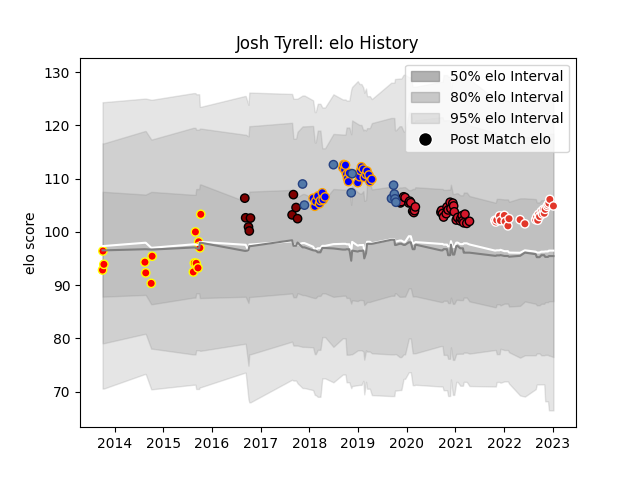

---  
layout: page  
title: Josh Tyrell  
date: 2023-01-06 11:43:59.883540  
categories: player  
---
# Josh Tyrell

## Positions: L, N8

## Country: Samoa

## Current elo: 105.0

## Current Percentile: 75.0

# Elo History

# Match History

| Team               |   Appearances |   Win Rate |
|:-------------------|--------------:|-----------:|
| Oyonnax            |            34 |   0.588235 |
| Doncaster          |            28 |   0.428571 |
| Biarritz Olympique |            26 |   0.5      |
| Waikato            |            16 |   0.4375   |
| Samoa              |            10 |   0.2      |
| North Harbour      |             9 |   0.555556 |

| Opponent                 |   Matches |   Win Rate |
|:-------------------------|----------:|-----------:|
| Montauban                |         5 |   0.6      |
| Rouen                    |         5 |   0.4      |
| Grenoble                 |         4 |   0.375    |
| Canterbury               |         4 |   0        |
| Perpignan                |         4 |   0.25     |
| Colomiers                |         4 |   0.375    |
| Bay of Plenty            |         4 |   1        |
| Soyaux-Angouleme         |         4 |   1        |
| Hartpury College         |         3 |   1        |
| Richmond                 |         3 |   0.666667 |
| Ealing Trailfinders      |         3 |   0.333333 |
| Jersey                   |         3 |   0        |
| Auckland                 |         3 |   0.333333 |
| Provence Rugby           |         3 |   1        |
| Mont-de-Marsan           |         3 |   0.5      |
| Nevers                   |         3 |   0.833333 |
| London Scottish          |         3 |   1        |
| Nottingham               |         3 |   0.333333 |
| Wellington               |         3 |   0.333333 |
| Bedford                  |         3 |   0.333333 |
| Tasman                   |         3 |   0        |
| Biarritz Olympique       |         3 |   0.666667 |
| Carcassonne              |         3 |   0.666667 |
| Brive                    |         2 |   0.5      |
| London Irish             |         2 |   0        |
| Aurillac                 |         2 |   1        |
| Beziers                  |         2 |   1        |
| Manawatu                 |         2 |   1        |
| Vannes                   |         2 |   0        |
| Yorkshire Carnegie       |         2 |   0        |
| Taranaki                 |         2 |   0.5      |
| Scotland                 |         2 |   0        |
| United States of America |         1 |   0        |
| Pau                      |         1 |   0        |
| Toulon                   |         1 |   0        |
| Russia                   |         1 |   1        |
| Southland                |         1 |   1        |
| Stade Toulousain         |         1 |   0        |
| Stade Francais Paris     |         1 |   1        |
| Agen                     |         1 |   0        |
| Oyonnax                  |         1 |   1        |
| Northland                |         1 |   1        |
| Australia                |         1 |   0        |
| Bordeaux Begles          |         1 |   0        |
| Bristol Rugby            |         1 |   0        |
| Castres Olympique        |         1 |   0        |
| Clermont Auvergne        |         1 |   0        |
| Cornish Pirates          |         1 |   0        |
| Counties Manukau         |         1 |   0        |
| Coventry                 |         1 |   1        |
| England                  |         1 |   0        |
| Georgia                  |         1 |   0        |
| Germany                  |         1 |   1        |
| Hawke's Bay              |         1 |   1        |
| Ireland                  |         1 |   0        |
| Japan                    |         1 |   0        |
| Massy                    |         1 |   1        |
| La Rochelle              |         1 |   1        |