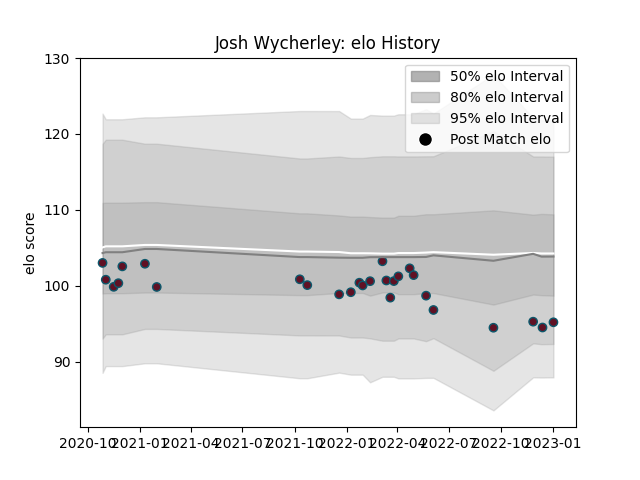

---  
layout: page  
title: Josh Wycherley  
date: 2022-12-14 11:19:56.216290  
categories: player  
---
# Josh Wycherley

## Positions: P

## Current elo: 86.0

## Current Percentile: 14.0

# Elo History

# Match History

| Team    |   Appearances |   Win Rate |
|:--------|--------------:|-----------:|
| Munster |            24 |      0.625 |

| Opponent         |   Matches |   Win Rate |
|:-----------------|----------:|-----------:|
| Cardiff Blues    |         3 |   0.666667 |
| Ulster           |         3 |   0.666667 |
| Benetton Treviso |         2 |   1        |
| Connacht         |         2 |   1        |
| Dragons          |         2 |   1        |
| Glasgow Warriors |         2 |   0.5      |
| Leinster         |         2 |   0        |
| Ospreys          |         2 |   0.5      |
| Zebre            |         2 |   1        |
| Bulls            |         1 |   0        |
| Lions            |         1 |   0        |
| Scarlets         |         1 |   1        |
| Stade Toulousain |         1 |   0        |