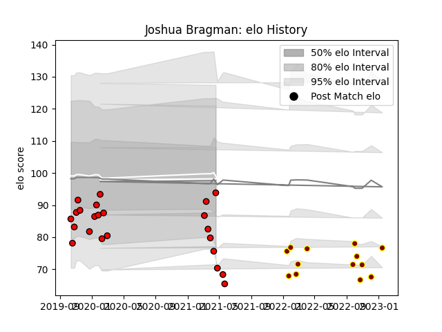

---  
layout: page  
title: Joshua Bragman  
date: 2022-12-12 14:58:49.536115  
categories: player  
---
# Joshua Bragman

## Positions: FH, C

## Current elo: 90.0

## Current Percentile: 36.0

# Elo History

# Match History

| Team             |   Appearances |   Win Rate |
|:-----------------|--------------:|-----------:|
| Hartpury College |            21 |   0.285714 |
| Ampthill         |            12 |   0.458333 |

| Opponent            |   Matches |   Win Rate |
|:--------------------|----------:|-----------:|
| Cornish Pirates     |         4 |   0.125    |
| Doncaster           |         4 |   0        |
| Bedford             |         3 |   0.333333 |
| Coventry            |         3 |   0.333333 |
| Jersey              |         3 |   0        |
| Nottingham          |         3 |   0.666667 |
| Ampthill            |         2 |   0        |
| Hartpury College    |         2 |   0.5      |
| London Scottish     |         2 |   1        |
| Newcastle Falcons   |         2 |   0        |
| Richmond            |         2 |   1        |
| Caldy               |         1 |   1        |
| Ealing Trailfinders |         1 |   0        |
| Yorkshire Carnegie  |         1 |   1        |