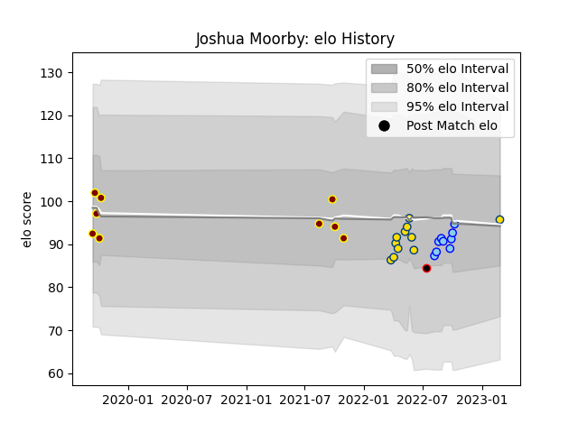

---  
layout: page  
title: Joshua Moorby  
date: 2023-03-02 11:21:08.756882  
categories: player  
---
# Joshua Moorby

## Positions: FB, W

## Country: New Zealand Maori

## Current elo: 96.0

## Current Percentile: 51.0

# Elo History

# Match History

| Team              |   Appearances |   Win Rate |
|:------------------|--------------:|-----------:|
| Hurricanes        |            11 |   0.545455 |
| Northland         |             9 |   0.666667 |
| Southland         |             9 |   0.222222 |
| New Zealand Maori |             1 |   0        |

| Opponent                 |   Matches |   Win Rate |
|:-------------------------|----------:|-----------:|
| Bay of Plenty            |         3 |   0.333333 |
| Auckland                 |         2 |   0.5      |
| Canterbury               |         2 |   0        |
| Tasman                   |         2 |   0        |
| Taranaki                 |         2 |   0.5      |
| Manawatu                 |         2 |   0.5      |
| Moana Pasifika           |         2 |   0.5      |
| New South Wales Waratahs |         1 |   1        |
| Wellington               |         1 |   1        |
| Waikato                  |         1 |   0        |
| Southland                |         1 |   1        |
| Queensland Reds          |         1 |   1        |
| Northland                |         1 |   1        |
| Melbourne Rebels         |         1 |   1        |
| Ireland                  |         1 |   0        |
| Highlanders              |         1 |   1        |
| Fijian Drua              |         1 |   1        |
| Crusaders                |         1 |   0        |
| Counties Manukau         |         1 |   1        |
| Chiefs                   |         1 |   0        |
| Brumbies                 |         1 |   0        |
| Western Force            |         1 |   0        |