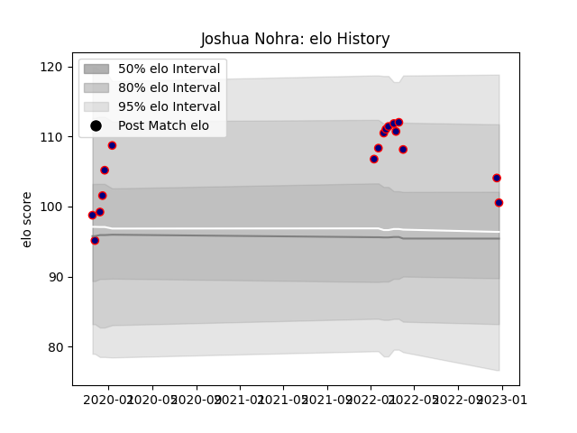

---  
layout: page  
title: Joshua Nohra  
date: 2023-02-02 18:40:11.929566  
categories: player  
---
# Joshua Nohra

## Positions: W

## Current elo: 83.0

## Current Percentile: 26.0

# Elo History

# Match History

| Team                     |   Appearances |   Win Rate |
|:-------------------------|--------------:|-----------:|
| Hanazono Kintetsu Liners |            21 |   0.619048 |

| Opponent                          |   Matches |   Win Rate |
|:----------------------------------|----------:|-----------:|
| Hino Red Dolphins                 |         2 |          1 |
| Kamaishi Seawaves                 |         2 |          1 |
| Mie Honda Heat                    |         2 |          1 |
| Mitsubishi Dynaboars              |         2 |          0 |
| Skyactivs Hiroshima               |         2 |          1 |
| Coca-Cola Red Sparks              |         1 |          1 |
| Green Rockets Tokatsu             |         1 |          0 |
| Kobelco Kobe Steelers             |         1 |          0 |
| Kubota Spears Funabashi Tokyo-Bay |         1 |          0 |
| Kyuden Voltex                     |         1 |          1 |
| Mazda Blue Zoomers                |         1 |          1 |
| Shimizu Blue Sharks               |         1 |          1 |
| Tokyo Sungoliath                  |         1 |          0 |
| Toshiba Brave Lupus Tokyo         |         1 |          0 |
| Toyota Industries Shuttles Aichi  |         1 |          1 |
| Yokohama Canon Eagles             |         1 |          0 |