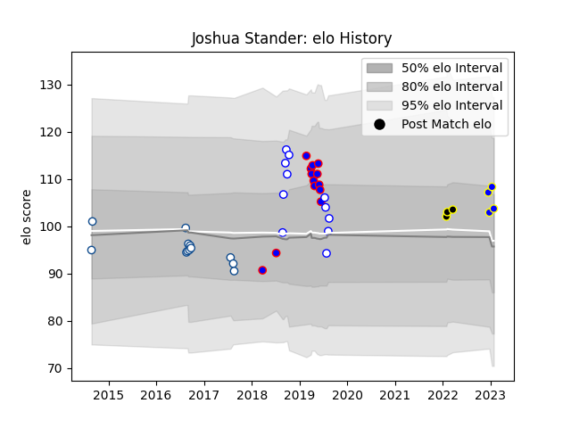

---  
layout: page  
title: Joshua Stander  
date: 2023-01-15 11:57:51.924047  
categories: player  
---
# Joshua Stander

## Positions: FH

## Current elo: 108.0

## Current Percentile: 64.0

# Elo History

# Match History

| Team              |   Appearances |   Win Rate |
|:------------------|--------------:|-----------:|
| Stormers          |            13 |   0.576923 |
| Blue Bulls        |            12 |   0.583333 |
| Western Province  |            11 |   0.727273 |
| Kamaishi Seawaves |             3 |   0.333333 |
| Tokyo Sungoliath  |             3 |   1        |

| Opponent                        |   Matches |   Win Rate |
|:--------------------------------|----------:|-----------:|
| Griquas                         |         4 |   0.75     |
| Free State Cheetahs             |         3 |   0.333333 |
| Golden Lions                    |         3 |   0.666667 |
| Pumas                           |         3 |   1        |
| Natal Sharks                    |         3 |   0.333333 |
| Western Province                |         2 |   0        |
| Sharks                          |         2 |   0.5      |
| Queensland Reds                 |         2 |   0.5      |
| Eastern Province Kings          |         2 |   1        |
| Blue Bulls                      |         2 |   1        |
| Lions                           |         2 |   0.5      |
| NTT Docomo Red Hurricanes Osaka |         1 |   1        |
| Urayasu D-Rocks                 |         1 |   1        |
| Sunwolves                       |         1 |   1        |
| Shimizu Blue Sharks             |         1 |   1        |
| Black Rams Tokyo                |         1 |   1        |
| Mie Honda Heat                  |         1 |   0        |
| Melbourne Rebels                |         1 |   1        |
| Highlanders                     |         1 |   1        |
| Crusaders                       |         1 |   0.5      |
| Bulls                           |         1 |   1        |
| Brumbies                        |         1 |   0        |
| Boland Cavaliers                |         1 |   1        |
| Blues                           |         1 |   0        |
| Hino Red Dolphins               |         1 |   0        |