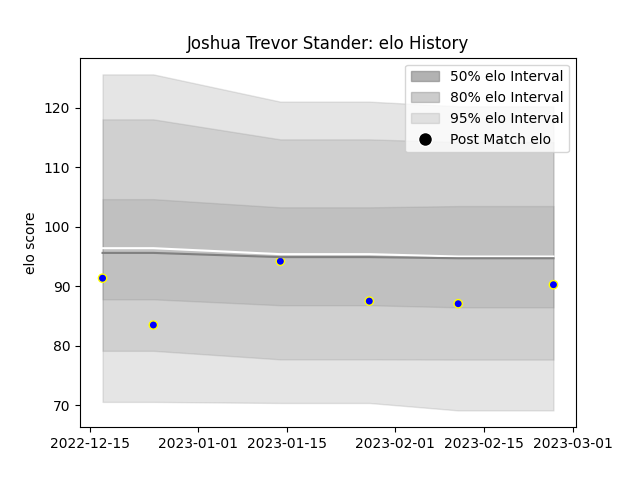

---  
layout: page  
title: Joshua Trevor Stander  
date: 2023-03-02 11:24:42.730782  
categories: player  
---
# Joshua Trevor Stander

## Positions: FH, C

## Current elo: 90.0

## Current Percentile: 28.0

# Elo History

# Match History

| Team              |   Appearances |   Win Rate |
|:------------------|--------------:|-----------:|
| Kamaishi Seawaves |             6 |   0.166667 |

| Opponent                         |   Matches |   Win Rate |
|:---------------------------------|----------:|-----------:|
| Mie Honda Heat                   |         2 |          0 |
| Hino Red Dolphins                |         1 |          0 |
| Shimizu Blue Sharks              |         1 |          1 |
| Toyota Industries Shuttles Aichi |         1 |          0 |
| Urayasu D-Rocks                  |         1 |          0 |