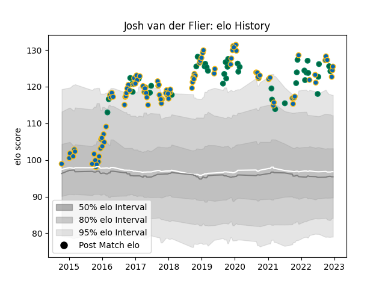

---  
layout: page  
title: Josh van der Flier  
date: 2022-12-14 11:29:34.211143  
categories: player  
---
# Josh van der Flier

## Positions: FL

## Country: Ireland

## Current elo: 124.0

## Current Percentile: 96.0

# Elo History

# Match History

| Team     |   Appearances |   Win Rate |
|:---------|--------------:|-----------:|
| Leinster |           102 |   0.803922 |
| Ireland  |            42 |   0.714286 |

| Opponent                 |   Matches |   Win Rate |
|:-------------------------|----------:|-----------:|
| Munster                  |        11 |   0.909091 |
| Ulster                   |        11 |   0.818182 |
| Glasgow Warriors         |         9 |   0.888889 |
| New Zealand              |         8 |   0.625    |
| Connacht                 |         8 |   0.875    |
| Benetton Treviso         |         6 |   1        |
| Dragons                  |         6 |   0.833333 |
| England                  |         6 |   0.333333 |
| Cardiff Blues            |         5 |   1        |
| Scotland                 |         5 |   0.8      |
| Italy                    |         5 |   1        |
| Montpellier Herault      |         4 |   0.75     |
| Scarlets                 |         4 |   0.25     |
| Japan                    |         4 |   0.75     |
| Edinburgh                |         4 |   1        |
| France                   |         4 |   0.5      |
| Wales                    |         4 |   0.75     |
| Wasps                    |         4 |   0.75     |
| Bath Rugby               |         4 |   0.75     |
| Northampton Saints       |         4 |   1        |
| Ospreys                  |         3 |   0.833333 |
| Stade Toulousain         |         2 |   0.5      |
| Toulon                   |         2 |   0        |
| Zebre                    |         2 |   1        |
| Australia                |         2 |   1        |
| Lyon                     |         2 |   1        |
| Exeter Chiefs            |         2 |   1        |
| Castres Olympique        |         2 |   0.75     |
| Bulls                    |         2 |   0.5      |
| Racing 92                |         1 |   1        |
| Samoa                    |         1 |   1        |
| Saracens                 |         1 |   0        |
| South Africa             |         1 |   1        |
| Southern Kings           |         1 |   1        |
| Clermont Auvergne        |         1 |   0        |
| Cheetahs                 |         1 |   0        |
| United States of America |         1 |   1        |
| Argentina                |         1 |   1        |