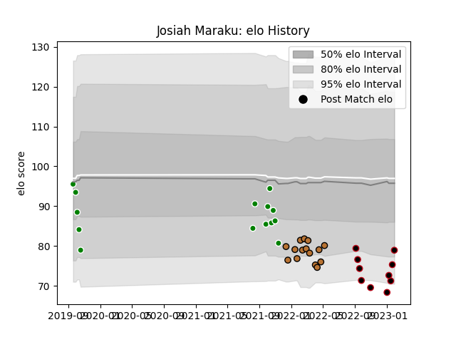

---  
layout: page  
title: Josiah Maraku  
date: 2023-01-01 11:18:31.106068  
categories: player  
---
# Josiah Maraku

## Positions: C

## Current elo: 72.0

## Current Percentile: 2.0

# Elo History

# Match History

| Team     |   Appearances |   Win Rate |
|:---------|--------------:|-----------:|
| Narbonne |            15 |   0.233333 |
| Manawatu |            14 |   0.428571 |
| Lyon     |             6 |   0.333333 |

| Opponent             |   Matches |   Win Rate |
|:---------------------|----------:|-----------:|
| Otago                |         2 |        0.5 |
| Brive                |         2 |        0.5 |
| Canterbury           |         2 |        0.5 |
| Carcassonne          |         2 |        0   |
| Counties Manukau     |         2 |        1   |
| Bay of Plenty        |         2 |        0   |
| Oyonnax              |         2 |        0   |
| Agen                 |         1 |        0   |
| US Bressane          |         1 |        1   |
| Taranaki             |         1 |        0   |
| Stade Francais Paris |         1 |        1   |
| Southland            |         1 |        1   |
| Rouen                |         1 |        1   |
| Racing 92            |         1 |        0   |
| Provence Rugby       |         1 |        1   |
| Perpignan            |         1 |        0   |
| Nevers               |         1 |        0   |
| Northland            |         1 |        1   |
| North Harbour        |         1 |        0   |
| Montauban            |         1 |        0   |
| Mont-de-Marsan       |         1 |        0   |
| La Rochelle          |         1 |        0   |
| Hawke's Bay          |         1 |        0   |
| Grenoble             |         1 |        0.5 |
| Colomiers            |         1 |        0   |
| Beziers              |         1 |        0   |
| Bayonne              |         1 |        0   |
| Wellington           |         1 |        0   |