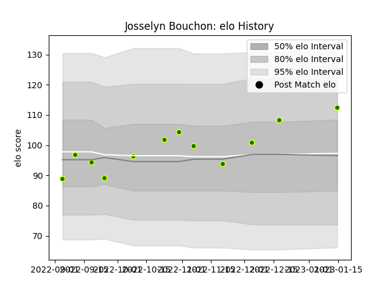

---  
layout: page  
title: Josselyn Bouchon  
date: 2022-11-22 11:35:30.482150  
categories: player  
---
# Josselyn Bouchon

## Positions: FB, W

## Current elo: 89.0

## Current Percentile: 38.0

# Elo History

# Match History

| Team                |   Appearances |   Win Rate |
|:--------------------|--------------:|-----------:|
| Carqueiranne-Hyères |             9 |   0.444444 |

| Opponent                   |   Matches |   Win Rate |
|:---------------------------|----------:|-----------:|
| Albi                       |         1 |          1 |
| Blagnac                    |         1 |          0 |
| Bourgoin-Jallieu           |         1 |          0 |
| Chambery                   |         1 |          1 |
| Cognac Saint Jean d'Angély |         1 |          1 |
| Rennes                     |         1 |          0 |
| Suresnes                   |         1 |          0 |
| Tarbes                     |         1 |          1 |
| Valence Romans Drome Rugby |         1 |          0 |