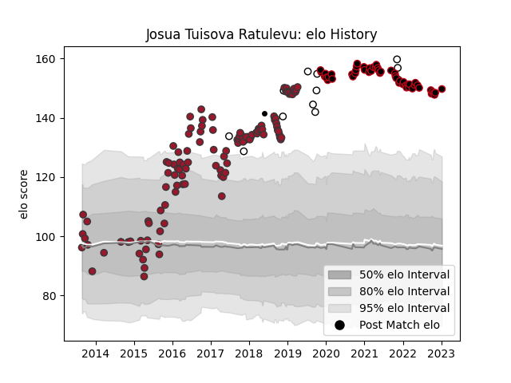

---  
layout: page  
title: Josua Tuisova Ratulevu  
date: 2023-02-02 18:50:38.628346  
categories: player  
---
# Josua Tuisova Ratulevu

## Positions: W, C

## Country: Fiji

## Current elo: 152.0

## Current Percentile: 99.0

# Elo History

# Match History

| Team       |   Appearances |   Win Rate |
|:-----------|--------------:|-----------:|
| Toulon     |           113 |   0.548673 |
| Lyon       |            56 |   0.544643 |
| Fiji       |            13 |   0.653846 |
| Barbarians |             1 |   1        |

| Opponent             |   Matches |   Win Rate |
|:---------------------|----------:|-----------:|
| Clermont Auvergne    |        14 |   0.428571 |
| Castres Olympique    |        13 |   0.538462 |
| Racing 92            |        12 |   0.25     |
| Brive                |        11 |   0.636364 |
| Montpellier Herault  |        11 |   0.454545 |
| La Rochelle          |        11 |   0.409091 |
| Stade Francais Paris |        10 |   0.6      |
| Pau                  |        10 |   0.65     |
| Stade Toulousain     |         9 |   0.666667 |
| Bordeaux Begles      |         9 |   0.555556 |
| Agen                 |         7 |   0.714286 |
| Grenoble             |         5 |   0.6      |
| Toulon               |         5 |   0.4      |
| Lyon                 |         5 |   0.7      |
| Perpignan            |         4 |   0.75     |
| Bath Rugby           |         4 |   0.75     |
| Oyonnax              |         4 |   0.75     |
| Bayonne              |         4 |   1        |
| Saracens             |         3 |   0        |
| Wasps                |         3 |   0.666667 |
| Newcastle Falcons    |         2 |   0.5      |
| Northampton Saints   |         2 |   0        |
| Wales                |         2 |   0        |
| Georgia              |         2 |   0.75     |
| Benetton Treviso     |         2 |   1        |
| Tonga                |         1 |   1        |
| Uruguay              |         1 |   1        |
| Sale Sharks          |         1 |   1        |
| Spain                |         1 |   1        |
| Scotland             |         1 |   1        |
| Scarlets             |         1 |   1        |
| England              |         1 |   1        |
| Biarritz Olympique   |         1 |   1        |
| France               |         1 |   1        |
| New Zealand Maori    |         1 |   1        |
| Munster              |         1 |   0        |
| Canada               |         1 |   1        |
| Australia            |         1 |   0        |
| Leinster             |         1 |   0        |
| Cardiff Blues        |         1 |   0        |
| Italy                |         1 |   0        |
| Edinburgh            |         1 |   0        |
| Glasgow Warriors     |         1 |   1        |
| Bulls                |         1 |   1        |