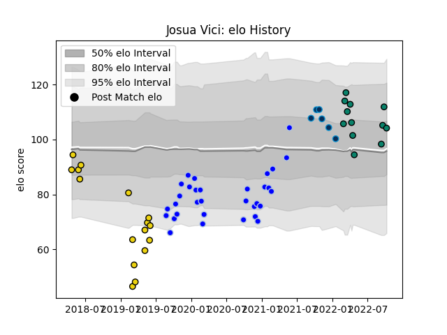

---  
layout: page  
title: Josua Vici  
date: 2023-03-21 18:20:05.029143  
categories: player  
---
# Josua Vici

Last updated: 2023-03-21
## Positions: W, C

## Current elo: 104.0

## Current Percentile: 81.0

# Elo History

# Match History

| Team                |   Appearances |   Win Rate |
|:--------------------|--------------:|-----------:|
| Colomiers           |            32 |   0.734375 |
| Houston SaberCats   |            16 |   0.3125   |
| Montauban           |            12 |   0.416667 |
| Montpellier Herault |             6 |   0.5      |

| Opponent             |   Matches |   Win Rate |
|:---------------------|----------:|-----------:|
| Beziers              |         6 |   0.5      |
| Mont-de-Marsan       |         5 |   0.6      |
| Biarritz Olympique   |         4 |   0.25     |
| Oyonnax              |         4 |   0.625    |
| NOLA Gold            |         3 |   0.333333 |
| Nevers               |         3 |   1        |
| Grenoble             |         3 |   0.666667 |
| Provence Rugby       |         3 |   0.666667 |
| Utah Warriors        |         2 |   0.5      |
| Soyaux-Angouleme     |         2 |   0.5      |
| Seattle Seawolves    |         2 |   0        |
| Rugby New York       |         2 |   0        |
| Roval Drome XV       |         2 |   1        |
| Rouen                |         2 |   1        |
| R.U. New York        |         2 |   0        |
| Agen                 |         2 |   1        |
| Aurillac             |         2 |   0        |
| Glendale Raptors     |         2 |   0.5      |
| Carcassonne          |         2 |   1        |
| Austin Elite Rugby   |         2 |   1        |
| Montauban            |         1 |   1        |
| Perpignan            |         1 |   1        |
| Leinster             |         1 |   0        |
| Racing 92            |         1 |   1        |
| Exeter Chiefs        |         1 |   0        |
| Brive                |         1 |   1        |
| San Diego Legion     |         1 |   0        |
| Bordeaux Begles      |         1 |   0        |
| Bayonne              |         1 |   0        |
| Stade Francais Paris |         1 |   1        |
| Vannes               |         1 |   1        |