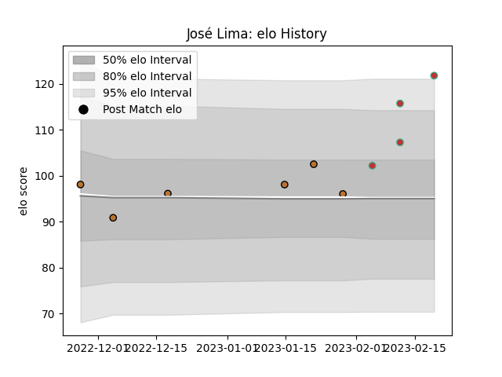

---  
layout: page  
title: José Lima  
date: 2023-03-17 17:22:40.445986  
categories: player  
---
# José Lima

## Positions: C

## Country: Portugal

## Current elo: 121.0

## Current Percentile: 95.0

# Elo History

# Match History

| Team     |   Appearances |   Win Rate |
|:---------|--------------:|-----------:|
| Narbonne |             6 |        0.5 |
| Portugal |             4 |        1   |

| Opponent         |   Matches |   Win Rate |
|:-----------------|----------:|-----------:|
| Poland           |         2 |          1 |
| Albi             |         1 |          0 |
| Belgium          |         1 |          1 |
| Bourgoin-Jallieu |         1 |          1 |
| Chambery         |         1 |          0 |
| Nice             |         1 |          1 |
| Romania          |         1 |          1 |
| Suresnes         |         1 |          1 |
| US Bressane      |         1 |          0 |