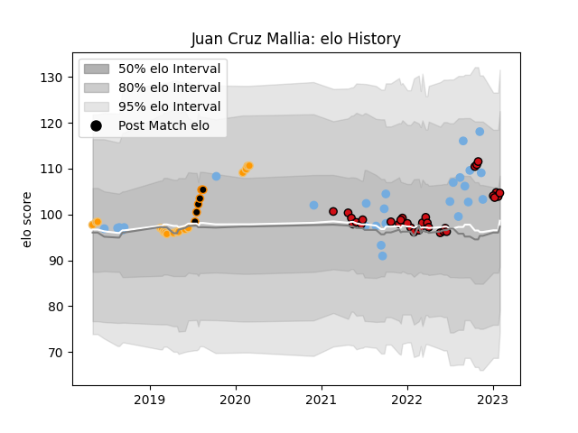

---  
layout: page  
title: Juan Cruz Mallia  
date: 2023-02-02 18:51:00.587354  
categories: player  
---
# Juan Cruz Mallia

## Positions: FB, W

## Country: Argentina

## Current elo: 105.0

## Current Percentile: 71.0

# Elo History

# Match History

| Team             |   Appearances |   Win Rate |
|:-----------------|--------------:|-----------:|
| Stade Toulousain |            32 |   0.59375  |
| Argentina        |            26 |   0.365385 |
| Jaguares         |            17 |   0.764706 |
| Jaguares XV      |             6 |   1        |

| Opponent                 |   Matches |   Win Rate |
|:-------------------------|----------:|-----------:|
| Australia                |         6 |   0.333333 |
| New Zealand              |         6 |   0.166667 |
| South Africa             |         5 |   0.2      |
| Scotland                 |         4 |   0.5      |
| La Rochelle              |         4 |   0.75     |
| Clermont Auvergne        |         3 |   0.666667 |
| Castres Olympique        |         3 |   0.333333 |
| Lions                    |         3 |   0.333333 |
| Bulls                    |         3 |   1        |
| Brive                    |         3 |   1        |
| Bordeaux Begles          |         3 |   0.666667 |
| Stormers                 |         3 |   0.333333 |
| Racing 92                |         2 |   0.5      |
| Sharks                   |         2 |   1        |
| Queensland Reds          |         2 |   1        |
| Bayonne                  |         2 |   0        |
| Wales                    |         2 |   0.25     |
| Lyon                     |         2 |   0.5      |
| Montpellier Herault      |         2 |   1        |
| Leopards                 |         1 |   1        |
| Border Bulldogs          |         1 |   1        |
| Biarritz Olympique       |         1 |   1        |
| Valke                    |         1 |   1        |
| United States of America |         1 |   1        |
| Toulon                   |         1 |   0        |
| Sunwolves                |         1 |   1        |
| Blues                    |         1 |   1        |
| Stade Francais Paris     |         1 |   0        |
| Boland Cavaliers         |         1 |   1        |
| Brumbies                 |         1 |   1        |
| England                  |         1 |   1        |
| Sale Sharks              |         1 |   1        |
| SWD Eagles               |         1 |   1        |
| Romania                  |         1 |   1        |
| Cardiff Blues            |         1 |   1        |
| Chiefs                   |         1 |   1        |
| Pau                      |         1 |   0        |
| Eastern Province Kings   |         1 |   1        |
| Munster                  |         1 |   1        |
| Wasps                    |         1 |   0        |