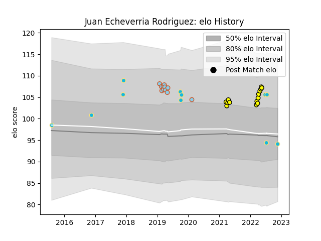

---  
layout: page  
title: Juan Echeverria Rodriguez  
date: 2022-11-22 11:45:33.241540  
categories: player  
---
# Juan Echeverria Rodriguez

## Positions: P

## Country: Uruguay

## Current elo: 94.0

## Current Percentile: 82.0

# Elo History

# Match History

| Team               |   Appearances |   Win Rate |
|:-------------------|--------------:|-----------:|
| Penarol Rugby      |            14 |   0.785714 |
| Uruguay            |            11 |   0.363636 |
| Austin Elite Rugby |            10 |   0        |
| Austin Herd        |             1 |   0        |

| Opponent          |   Matches |   Win Rate |
|:------------------|----------:|-----------:|
| Cobras            |         4 |   1        |
| Selknam           |         3 |   0.666667 |
| Jaguares XV       |         3 |   0.666667 |
| Olimpia Lions     |         3 |   0.666667 |
| Namibia           |         2 |   1        |
| Romania           |         2 |   0.5      |
| Glendale Raptors  |         2 |   0        |
| NOLA Gold         |         2 |   0        |
| San Diego Legion  |         2 |   0        |
| Utah Warriors     |         1 |   0        |
| Toronto Arrows    |         1 |   0        |
| Tonga             |         1 |   0        |
| Seattle Seawolves |         1 |   0        |
| Argentina         |         1 |   1        |
| R.U. New York     |         1 |   0        |
| Australia         |         1 |   0        |
| Japan             |         1 |   0        |
| Houston SaberCats |         1 |   0        |
| Germany           |         1 |   0        |
| Georgia           |         1 |   0        |
| Cafeteros Pro     |         1 |   1        |
| Wales             |         1 |   0        |