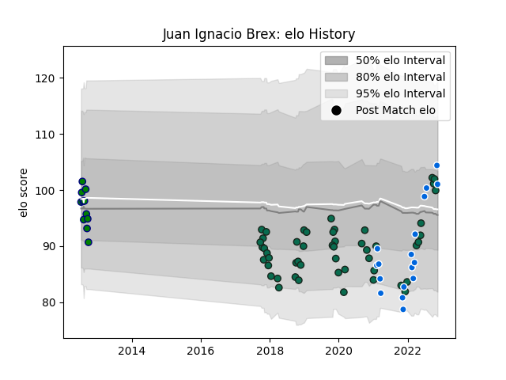

---  
layout: page  
title: Juan Ignacio Brex  
date: 2022-11-16 11:41:14.618037  
categories: player  
---
# Juan Ignacio Brex

## Positions: C

## Country: Italy

## Current elo: 101.0

## Current Percentile: 77.0

# Elo History

# Match History

| Team             |   Appearances |   Win Rate |
|:-----------------|--------------:|-----------:|
| Benetton Treviso |            50 |   0.41     |
| Italy            |            17 |   0.294118 |
| San Cirano       |            11 |   0.409091 |

| Opponent             |   Matches |   Win Rate |
|:---------------------|----------:|-----------:|
| Zebre                |         9 |   0.777778 |
| Scarlets             |         6 |   0.166667 |
| Southern Kings       |         4 |   1        |
| Edinburgh            |         4 |   0.25     |
| Ulster               |         4 |   0.125    |
| Cardiff Blues        |         4 |   0.25     |
| Leinster             |         3 |   0        |
| Dragons              |         3 |   1        |
| Scotland             |         2 |   0        |
| Bulls                |         2 |   0        |
| Toulon               |         2 |   0        |
| England              |         2 |   0        |
| France               |         2 |   0        |
| Ireland              |         2 |   0        |
| Ospreys              |         2 |   0.5      |
| Wales                |         2 |   0.5      |
| San Luis             |         1 |   1        |
| New Zealand          |         1 |   0        |
| Uruguay              |         1 |   1        |
| Samoa                |         1 |   1        |
| Pucara               |         1 |   0        |
| Portugal             |         1 |   1        |
| Northampton Saints   |         1 |   0        |
| Newman               |         1 |   0        |
| Alumni               |         1 |   0.5      |
| Munster              |         1 |   0        |
| Los Tilos            |         1 |   1        |
| Lomas                |         1 |   0        |
| Argentina            |         1 |   0        |
| Grenoble             |         1 |   1        |
| Glasgow Warriors     |         1 |   1        |
| Georgia              |         1 |   0        |
| Connacht             |         1 |   0        |
| Cheetahs             |         1 |   0        |
| CUBA                 |         1 |   0.5      |
| CASI                 |         1 |   1        |
| Belgrano             |         1 |   0.5      |
| Bath Rugby           |         1 |   0        |
| Australia            |         1 |   1        |
| Atlético del Rosario |         1 |   0        |
| La Plata             |         1 |   0        |