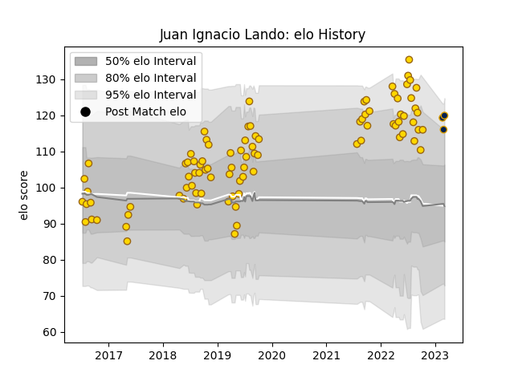

---  
layout: page  
title: Juan Ignacio Lando  
date: 2023-03-04 11:40:26.422784  
categories: player  
---
# Juan Ignacio Lando

## Positions: FB, W

## Current elo: 120.0

## Current Percentile: 89.0

# Elo History

# Match History

| Team      |   Appearances |   Win Rate |
|:----------|--------------:|-----------:|
| Belgrano  |            91 |   0.631868 |
| Pampas XV |             3 |   0.666667 |

| Opponent             |   Matches |   Win Rate |
|:---------------------|----------:|-----------:|
| CASI                 |         9 |   0.777778 |
| CUBA                 |         9 |   0.333333 |
| San Luis             |         9 |   0.611111 |
| SIC                  |         9 |   0.222222 |
| Pucara               |         8 |   0.875    |
| Newman               |         8 |   0.5625   |
| Alumni               |         7 |   0.285714 |
| Hindu                |         7 |   0.714286 |
| Atlético del Rosario |         6 |   1        |
| Regatas Bella Vista  |         6 |   0.5      |
| Buenos Aires         |         3 |   0.833333 |
| Los Tilos            |         3 |   1        |
| San Martin           |         2 |   1        |
| Lomas                |         2 |   1        |
| La Plata             |         2 |   1        |
| Mariano Moreno       |         1 |   1        |
| American Raptors     |         1 |   1        |
| Cobras               |         1 |   1        |
| Selknam              |         1 |   0        |