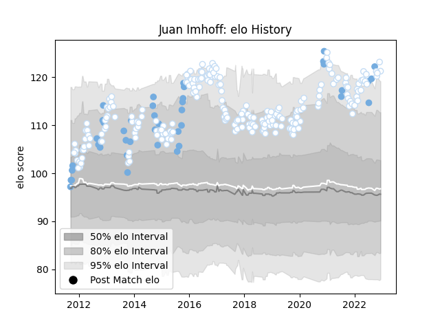

---  
layout: page  
title: Juan Imhoff  
date: 2023-02-02 18:49:30.787717  
categories: player  
---
# Juan Imhoff

## Positions: W

## Country: Argentina

## Current elo: 134.0

## Current Percentile: 97.0

# Elo History

# Match History

| Team      |   Appearances |   Win Rate |
|:----------|--------------:|-----------:|
| Racing 92 |           232 |   0.603448 |
| Argentina |            42 |   0.440476 |

| Opponent             |   Matches |   Win Rate |
|:---------------------|----------:|-----------:|
| Castres Olympique    |        19 |   0.605263 |
| Montpellier Herault  |        17 |   0.705882 |
| Clermont Auvergne    |        17 |   0.647059 |
| Stade Francais Paris |        16 |   0.5625   |
| Stade Toulousain     |        15 |   0.4      |
| Bordeaux Begles      |        14 |   0.571429 |
| La Rochelle          |        14 |   0.571429 |
| Toulon               |        13 |   0.615385 |
| Lyon                 |        11 |   0.454545 |
| Australia            |        11 |   0.272727 |
| Agen                 |        10 |   0.75     |
| Brive                |         8 |   0.75     |
| Saracens             |         7 |   0.285714 |
| New Zealand          |         7 |   0.142857 |
| Bayonne              |         7 |   0.714286 |
| Grenoble             |         6 |   0.833333 |
| Perpignan            |         6 |   0.666667 |
| Pau                  |         6 |   0.916667 |
| South Africa         |         5 |   0.3      |
| Leicester Tigers     |         5 |   0.8      |
| Biarritz Olympique   |         5 |   0.4      |
| Scarlets             |         5 |   0.7      |
| Scotland             |         4 |   0.5      |
| Northampton Saints   |         4 |   0.875    |
| Edinburgh            |         4 |   0.5      |
| Oyonnax              |         3 |   0.333333 |
| Munster              |         3 |   0.5      |
| Ospreys              |         3 |   1        |
| Romania              |         2 |   1        |
| Ulster               |         2 |   0.5      |
| Wales                |         2 |   1        |
| Ireland              |         2 |   0.5      |
| Harlequins           |         2 |   0.5      |
| Glasgow Warriors     |         2 |   0.5      |
| Georgia              |         2 |   1        |
| France               |         2 |   0.5      |
| England              |         2 |   0        |
| Cardiff Blues        |         2 |   0        |
| Benetton Treviso     |         2 |   1        |
| Namibia              |         1 |   1        |
| Mont-de-Marsan       |         1 |   1        |
| Leinster             |         1 |   0        |
| Italy                |         1 |   1        |
| Exeter Chiefs        |         1 |   0        |
| Tonga                |         1 |   1        |
| London Irish         |         1 |   0        |