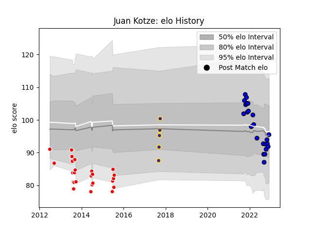

---  
layout: page  
title: Juan Kotze  
date: 2022-11-22 11:36:24.797525  
categories: player  
---
# Juan Kotze

## Positions: FH, FB

## Current elo: 92.0

## Current Percentile: 46.0

# Elo History

# Match History

| Team     |   Appearances |   Win Rate |
|:---------|--------------:|-----------:|
| Valke    |            25 |   0.28     |
| Massy    |            22 |   0.681818 |
| Griffons |             5 |   1        |

| Opponent                   |   Matches |   Win Rate |
|:---------------------------|----------:|-----------:|
| Leopards                   |         5 |       0.2  |
| Boland Cavaliers           |         5 |       0.4  |
| SWD Eagles                 |         5 |       0.6  |
| Border Bulldogs            |         4 |       0.75 |
| Griffons                   |         4 |       0.25 |
| Bourgoin-Jallieu           |         2 |       1    |
| Nice                       |         2 |       0.5  |
| Dijon                      |         2 |       1    |
| Eastern Province Kings     |         2 |       0.5  |
| Griquas                    |         2 |       0    |
| Pumas                      |         2 |       0    |
| Valence Romans Drome Rugby |         1 |       1    |
| Suresnes                   |         1 |       1    |
| Soyaux-Angouleme           |         1 |       1    |
| Rouen                      |         1 |       0    |
| Provence Rugby             |         1 |       1    |
| Oyonnax                    |         1 |       0    |
| Aubenas                    |         1 |       1    |
| Nevers                     |         1 |       0    |
| Montauban                  |         1 |       0    |
| Mont-de-Marsan             |         1 |       1    |
| Beziers                    |         1 |       0    |
| Dax                        |         1 |       1    |
| Cognac Saint Jean d'Angély |         1 |       1    |
| Chambery                   |         1 |       1    |
| Carcassonne                |         1 |       1    |
| Biarritz Olympique         |         1 |       0    |
| Valke                      |         1 |       1    |