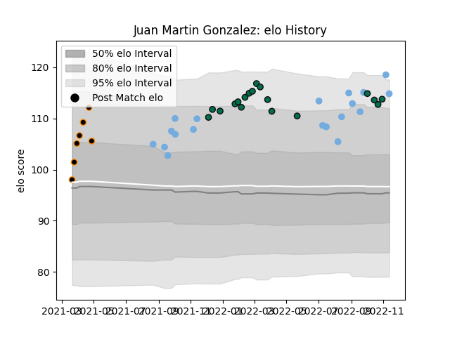

---  
layout: page  
title: Juan Martin Gonzalez  
date: 2022-12-14 11:26:15.210771  
categories: player  
---
# Juan Martin Gonzalez

## Positions: FL

## Country: Argentina

## Current elo: 112.0

## Current Percentile: 91.0

# Elo History

# Match History

| Team         |   Appearances |   Win Rate |
|:-------------|--------------:|-----------:|
| London Irish |            21 |   0.404762 |
| Argentina    |            20 |   0.3      |
| Jaguares XV  |             7 |   1        |

| Opponent            |   Matches |   Win Rate |
|:--------------------|----------:|-----------:|
| Australia           |         5 |       0.2  |
| Scotland            |         4 |       0.5  |
| New Zealand         |         4 |       0.25 |
| South Africa        |         3 |       0    |
| Gloucester Rugby    |         2 |       0    |
| Harlequins          |         2 |       0    |
| Selknam             |         2 |       1    |
| Leicester Tigers    |         2 |       0    |
| Bath Rugby          |         2 |       0.5  |
| Newcastle Falcons   |         2 |       1    |
| Saracens            |         2 |       0.5  |
| Olimpia Lions       |         2 |       1    |
| Sale Sharks         |         2 |       0.25 |
| Cafeteros Pro       |         1 |       1    |
| Penarol Rugby       |         1 |       1    |
| Wasps               |         1 |       0    |
| Wales               |         1 |       0    |
| Bristol Rugby       |         1 |       1    |
| Northampton Saints  |         1 |       0    |
| Pau                 |         1 |       1    |
| Cobras              |         1 |       1    |
| Montpellier Herault |         1 |       0    |
| Italy               |         1 |       1    |
| France              |         1 |       0    |
| Exeter Chiefs       |         1 |       1    |
| England             |         1 |       1    |
| Worcester Warriors  |         1 |       1    |