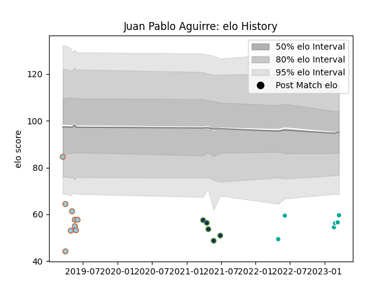

---  
layout: page  
title: Juan Pablo Aguirre  
date: 2023-03-17 17:33:56.259243  
categories: player  
---
# Juan Pablo Aguirre

## Positions: C, FH

## Current elo: 57.0

## Current Percentile: 1.0

# Elo History

# Match History

| Team               |   Appearances |   Win Rate |
|:-------------------|--------------:|-----------:|
| Austin Elite Rugby |             9 |          0 |
| Dallas Jackals     |             5 |          0 |
| Seattle Seawolves  |             5 |          0 |

| Opponent          |   Matches |   Win Rate |
|:------------------|----------:|-----------:|
| Utah Warriors     |         3 |          0 |
| Houston SaberCats |         2 |          0 |
| L. A. Giltinis    |         2 |          0 |
| R.U. New York     |         2 |          0 |
| Rugby New York    |         2 |          0 |
| San Diego Legion  |         2 |          0 |
| Seattle Seawolves |         2 |          0 |
| Austin Gilgronis  |         1 |          0 |
| NOLA Gold         |         1 |          0 |
| Rugby ATL         |         1 |          0 |
| Toronto Arrows    |         1 |          0 |