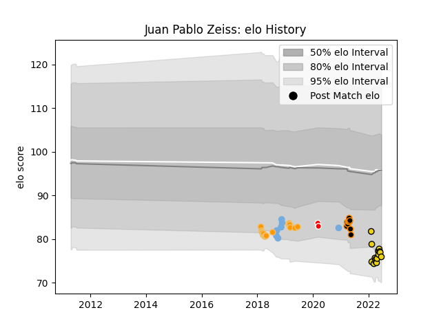

---  
layout: page  
title: Juan Pablo Zeiss  
date: 2023-03-17 17:24:34.180321  
categories: player  
---
# Juan Pablo Zeiss

## Positions: P

## Country: Argentina

## Current elo: 76.0

## Current Percentile: 9.0

# Elo History

# Match History

| Team              |   Appearances |   Win Rate |
|:------------------|--------------:|-----------:|
| Jaguares          |            17 |   0.470588 |
| Houston SaberCats |            15 |   0.533333 |
| Jaguares XV       |            10 |   1        |
| Los Matreros      |             8 |   0.1875   |
| Argentina         |             7 |   0.214286 |
| Ceibos Rugby      |             2 |   1        |

| Opponent                 |   Matches |   Win Rate |
|:-------------------------|----------:|-----------:|
| Lions                    |         5 |   0.2      |
| Selknam                  |         3 |   1        |
| Penarol Rugby            |         3 |   1        |
| Olimpia Lions            |         3 |   1        |
| Seattle Seawolves        |         3 |   0.333333 |
| Utah Warriors            |         2 |   1        |
| Austin Gilgronis         |         2 |   0        |
| L. A. Giltinis           |         2 |   0.5      |
| New Zealand              |         2 |   0        |
| Cafeteros Pro            |         2 |   1        |
| Blues                    |         2 |   1        |
| Australia                |         2 |   0.75     |
| Scotland                 |         1 |   0        |
| Stormers                 |         1 |   0        |
| San Albano               |         1 |   0        |
| SIC                      |         1 |   0        |
| Rugby New York           |         1 |   0        |
| Regatas Bella Vista      |         1 |   0        |
| Sunwolves                |         1 |   1        |
| Toronto Arrows           |         1 |   1        |
| R.U. New York            |         1 |   0        |
| Queensland Reds          |         1 |   0        |
| San Diego Legion         |         1 |   1        |
| Alumni                   |         1 |   0        |
| Old Glory DC             |         1 |   1        |
| New South Wales Waratahs |         1 |   1        |
| Mariano Moreno           |         1 |   0.5      |
| Lomas                    |         1 |   1        |
| Ireland                  |         1 |   0        |
| Hurricanes               |         1 |   0        |
| Highlanders              |         1 |   0        |
| France                   |         1 |   0        |
| Dallas Jackals           |         1 |   1        |
| Crusaders                |         1 |   0        |
| Cobras                   |         1 |   1        |
| Champagnat               |         1 |   0        |
| CUBA                     |         1 |   0        |
| Bulls                    |         1 |   1        |
| Brumbies                 |         1 |   1        |
| Melbourne Rebels         |         1 |   1        |