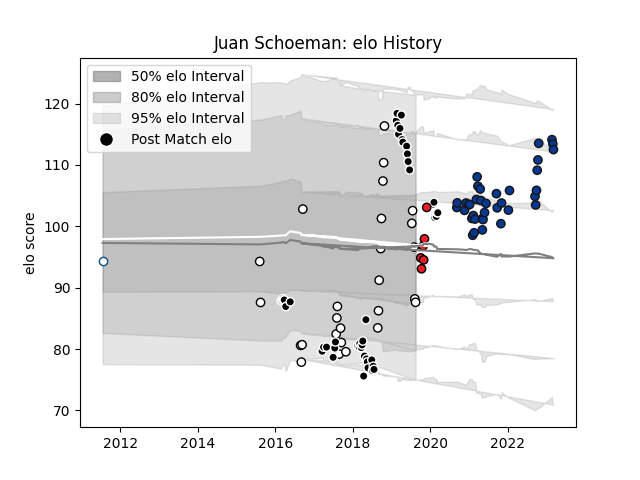

---  
layout: page  
title: Juan Schoeman  
date: 2023-03-17 17:06:28.136678  
categories: player  
---
# Juan Schoeman

## Positions: P

## Current elo: 88.0

## Current Percentile: 50.0

# Elo History

# Match History

| Team           |   Appearances |   Win Rate |
|:---------------|--------------:|-----------:|
| Sharks         |            47 |   0.510638 |
| Bath Rugby     |            36 |   0.333333 |
| Natal Sharks   |            26 |   0.730769 |
| Southern Kings |             6 |   0.166667 |
| Blue Bulls     |             1 |   0        |

| Opponent                 |   Matches |   Win Rate |
|:-------------------------|----------:|-----------:|
| Lions                    |         8 |   0.375    |
| Jaguares                 |         7 |   0.571429 |
| Western Province         |         6 |   0.5      |
| Bulls                    |         6 |   0.25     |
| Stormers                 |         5 |   0.6      |
| Sale Sharks              |         5 |   0.4      |
| Pumas                    |         5 |   0.6      |
| Griquas                  |         4 |   0.75     |
| Wasps                    |         4 |   0        |
| Northampton Saints       |         4 |   0.75     |
| Leicester Tigers         |         4 |   0.25     |
| Worcester Warriors       |         4 |   1        |
| Southern Kings           |         3 |   1        |
| Newcastle Falcons        |         3 |   0.333333 |
| Hurricanes               |         3 |   0        |
| Free State Cheetahs      |         3 |   0.666667 |
| Bristol Rugby            |         3 |   0        |
| Golden Lions             |         3 |   1        |
| Blue Bulls               |         3 |   1        |
| Gloucester Rugby         |         2 |   0.5      |
| Melbourne Rebels         |         2 |   0.5      |
| Crusaders                |         2 |   0        |
| Sunwolves                |         2 |   1        |
| London Irish             |         2 |   0        |
| Eastern Province Kings   |         2 |   1        |
| Highlanders              |         2 |   1        |
| Harlequins               |         2 |   0        |
| Blues                    |         2 |   1        |
| Queensland Reds          |         2 |   0.5      |
| Ulster                   |         1 |   0        |
| Chiefs                   |         1 |   1        |
| Brumbies                 |         1 |   0        |
| Saracens                 |         1 |   0        |
| New South Wales Waratahs |         1 |   0.5      |
| Connacht                 |         1 |   0        |
| Ospreys                  |         1 |   1        |
| Natal Sharks             |         1 |   0        |
| Munster                  |         1 |   0        |
| Montpellier Herault      |         1 |   0        |
| La Rochelle              |         1 |   0        |
| Glasgow Warriors         |         1 |   0        |
| Benetton Treviso         |         1 |   0        |