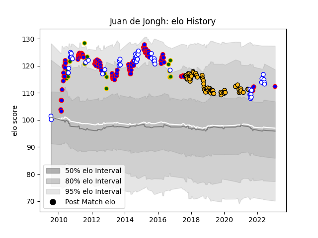

---  
layout: page  
title: Juan de Jongh  
date: 2023-01-30 11:48:04.202340  
categories: player  
---
# Juan de Jongh

## Positions: C

## Country: South Africa

## Current elo: 112.0

## Current Percentile: 84.0

# Elo History

# Match History

| Team             |   Appearances |   Win Rate |
|:-----------------|--------------:|-----------:|
| Stormers         |           101 |   0.648515 |
| Wasps            |            69 |   0.478261 |
| Western Province |            50 |   0.7      |
| South Africa     |            22 |   0.545455 |

| Opponent                 |   Matches |   Win Rate |
|:-------------------------|----------:|-----------:|
| Bulls                    |        12 |   0.75     |
| Sharks                   |        12 |   0.5      |
| Cheetahs                 |        12 |   0.75     |
| Golden Lions             |         9 |   0.388889 |
| Lions                    |         9 |   0.833333 |
| Blue Bulls               |         9 |   0.555556 |
| Griquas                  |         9 |   0.777778 |
| Brumbies                 |         7 |   0.571429 |
| Pumas                    |         7 |   0.928571 |
| New South Wales Waratahs |         7 |   0.571429 |
| Australia                |         7 |   0.428571 |
| Natal Sharks             |         6 |   0.833333 |
| Bath Rugby               |         6 |   0.416667 |
| Gloucester Rugby         |         6 |   0.25     |
| New Zealand              |         6 |   0        |
| Free State Cheetahs      |         6 |   0.666667 |
| Saracens                 |         6 |   0.166667 |
| Harlequins               |         6 |   0.5      |
| Sale Sharks              |         5 |   0.4      |
| Exeter Chiefs            |         5 |   0.4      |
| Northampton Saints       |         5 |   0.6      |
| Newcastle Falcons        |         5 |   0.6      |
| Highlanders              |         5 |   0.8      |
| Leicester Tigers         |         5 |   0.4      |
| Blues                    |         5 |   0.8      |
| Crusaders                |         5 |   0.2      |
| Worcester Warriors       |         4 |   1        |
| Queensland Reds          |         4 |   0.25     |
| Melbourne Rebels         |         4 |   0.75     |
| Chiefs                   |         4 |   0.25     |
| Bristol Rugby            |         4 |   1        |
| Western Force            |         4 |   1        |
| London Irish             |         4 |   0.5      |
| Eastern Province Kings   |         3 |   1        |
| Sunwolves                |         2 |   0.75     |
| Ulster                   |         2 |   0.5      |
| Italy                    |         2 |   1        |
| Edinburgh                |         2 |   0.25     |
| Leinster                 |         2 |   0.5      |
| La Rochelle              |         2 |   0.5      |
| Hurricanes               |         2 |   1        |
| Namibia                  |         1 |   1        |
| Benetton Treviso         |         1 |   0        |
| Wales                    |         1 |   1        |
| Bordeaux Begles          |         1 |   0        |
| Dragons                  |         1 |   1        |
| Stade Toulousain         |         1 |   0        |
| Southern Kings           |         1 |   1        |
| England                  |         1 |   1        |
| Scotland                 |         1 |   1        |
| Leopards                 |         1 |   1        |
| Fiji                     |         1 |   1        |
| France                   |         1 |   1        |
| Argentina                |         1 |   1        |
| Jaguares                 |         1 |   1        |
| Agen                     |         1 |   1        |