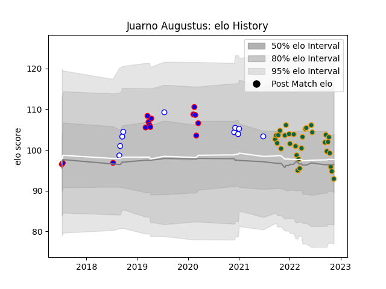

---  
layout: page  
title: Juarno Augustus  
date: 2022-12-09 13:24:24.829667  
categories: player  
---
# Juarno Augustus

## Positions: N8

## Current elo: 90.0

## Current Percentile: 32.0

# Elo History

# Match History

| Team               |   Appearances |   Win Rate |
|:-------------------|--------------:|-----------:|
| Northampton Saints |            32 |   0.53125  |
| Stormers           |            14 |   0.642857 |
| Western Province   |            10 |   0.7      |

| Opponent            |   Matches |   Win Rate |
|:--------------------|----------:|-----------:|
| Leicester Tigers    |         4 |   0        |
| Gloucester Rugby    |         3 |   0.333333 |
| Wasps               |         3 |   0.666667 |
| Sharks              |         3 |   0.666667 |
| London Irish        |         3 |   1        |
| Harlequins          |         3 |   0.333333 |
| Golden Lions        |         3 |   0.333333 |
| Bath Rugby          |         3 |   0.666667 |
| Bristol Rugby       |         3 |   1        |
| Free State Cheetahs |         2 |   1        |
| Bulls               |         2 |   1        |
| Blues               |         2 |   0        |
| Saracens            |         2 |   0        |
| Sale Sharks         |         2 |   0        |
| Griquas             |         2 |   1        |
| Newcastle Falcons   |         2 |   1        |
| Blue Bulls          |         2 |   0.5      |
| Jaguares            |         2 |   1        |
| Exeter Chiefs       |         2 |   0.5      |
| Worcester Warriors  |         2 |   1        |
| Melbourne Rebels    |         1 |   1        |
| Lions               |         1 |   1        |
| Pumas               |         1 |   1        |
| Queensland Reds     |         1 |   0        |
| Hurricanes          |         1 |   0        |
| Sunwolves           |         1 |   1        |