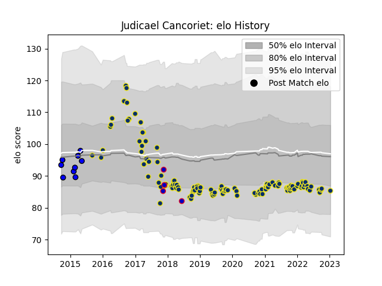

---  
layout: page  
title: Judicael Cancoriet  
date: 2023-01-13 11:23:54.456547  
categories: player  
---
# Judicael Cancoriet

## Positions: FL

## Country: France

## Current elo: 85.0

## Current Percentile: 22.0

# Elo History

# Match History

| Team              |   Appearances |   Win Rate |
|:------------------|--------------:|-----------:|
| Clermont Auvergne |           121 |   0.640496 |
| Massy             |             9 |   0.333333 |
| France            |             4 |   0.125    |

| Opponent             |   Matches |   Win Rate |
|:---------------------|----------:|-----------:|
| Bordeaux Begles      |        12 |   0.458333 |
| Stade Toulousain     |        11 |   0.409091 |
| Toulon               |        10 |   0.6      |
| La Rochelle          |        10 |   0.7      |
| Lyon                 |        10 |   0.7      |
| Stade Francais Paris |         9 |   0.666667 |
| Pau                  |         8 |   0.75     |
| Montpellier Herault  |         8 |   0.625    |
| Castres Olympique    |         7 |   0.571429 |
| Racing 92            |         6 |   0.5      |
| Brive                |         6 |   0.5      |
| Perpignan            |         5 |   0.8      |
| Agen                 |         4 |   0.75     |
| Bayonne              |         3 |   1        |
| Northampton Saints   |         3 |   1        |
| Oyonnax              |         2 |   0.5      |
| Bourgoin-Jallieu     |         2 |   0.5      |
| Timisoara Saracens   |         2 |   1        |
| Aurillac             |         2 |   0.5      |
| New Zealand          |         2 |   0        |
| South Africa         |         1 |   0        |
| Saracens             |         1 |   1        |
| Biarritz Olympique   |         1 |   1        |
| Japan                |         1 |   0.5      |
| Carcassonne          |         1 |   0        |
| Grenoble             |         1 |   0.5      |
| Ospreys              |         1 |   1        |
| Narbonne             |         1 |   1        |
| Dragons              |         1 |   1        |
| Albi                 |         1 |   0        |
| Exeter Chiefs        |         1 |   0        |
| Montauban            |         1 |   0        |