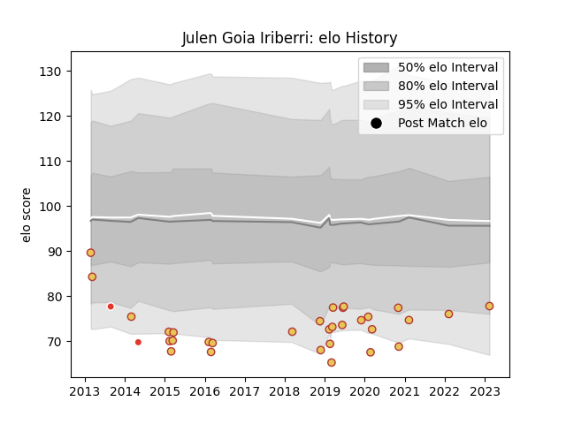

---  
layout: page  
title: Julen Goia Iriberri  
date: 2023-02-15 22:13:49.953404  
categories: player  
---
# Julen Goia Iriberri

## Positions: W

## Country: Spain

## Current elo: 78.0

## Current Percentile: None

# Elo History

# Match History

| Team               |   Appearances |   Win Rate |
|:-------------------|--------------:|-----------:|
| Spain              |            31 |   0.612903 |
| Biarritz Olympique |             2 |   0.5      |

| Opponent            |   Matches |   Win Rate |
|:--------------------|----------:|-----------:|
| Georgia             |         5 |   0        |
| Romania             |         5 |   0.2      |
| Russia              |         4 |   0.75     |
| Germany             |         3 |   1        |
| Portugal            |         3 |   1        |
| Uruguay             |         3 |   0.666667 |
| Belgium             |         2 |   1        |
| Bordeaux Begles     |         1 |   0        |
| Brazil              |         1 |   1        |
| Chile               |         1 |   1        |
| Hong Kong           |         1 |   1        |
| Montpellier Herault |         1 |   1        |
| Namibia             |         1 |   1        |
| Netherlands         |         1 |   1        |
| Samoa               |         1 |   0        |