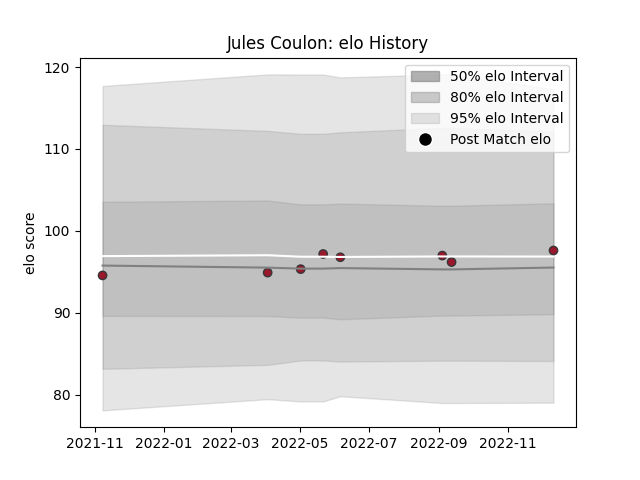

---  
layout: page  
title: Jules Coulon  
date: 2022-12-18 16:23:12.645528  
categories: player  
---
# Jules Coulon

## Positions: FL

## Current elo: 101.0

## Current Percentile: 58.0

# Elo History

# Match History

| Team   |   Appearances |   Win Rate |
|:-------|--------------:|-----------:|
| Toulon |             9 |   0.666667 |

| Opponent          |   Matches |   Win Rate |
|:------------------|----------:|-----------:|
| Bath Rugby        |         1 |          1 |
| Bayonne           |         1 |          1 |
| Bordeaux Begles   |         1 |          1 |
| Clermont Auvergne |         1 |          0 |
| Lyon              |         1 |          1 |
| Pau               |         1 |          1 |
| Racing 92         |         1 |          0 |
| Stade Toulousain  |         1 |          0 |
| Zebre             |         1 |          1 |