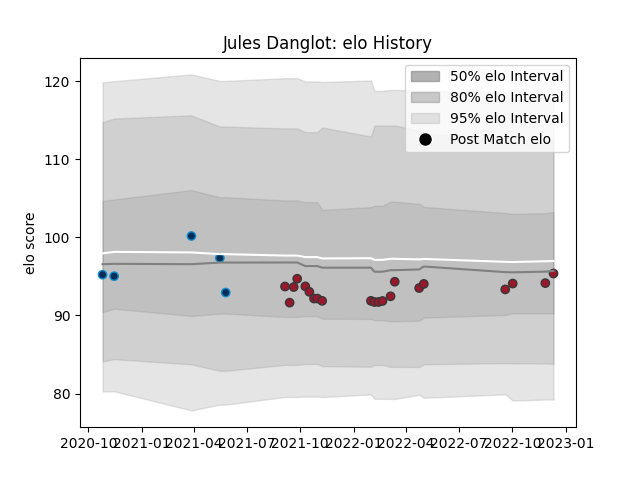

---  
layout: page  
title: Jules Danglot  
date: 2022-12-18 16:25:32.109882  
categories: player  
---
# Jules Danglot

## Positions: SH

## Current elo: 99.0

## Current Percentile: 47.0

# Elo History

# Match History

| Team                |   Appearances |   Win Rate |
|:--------------------|--------------:|-----------:|
| Toulon              |            22 |   0.613636 |
| Montpellier Herault |             5 |   0.4      |

| Opponent             |   Matches |   Win Rate |
|:---------------------|----------:|-----------:|
| Stade Francais Paris |         4 |   0.5      |
| Bordeaux Begles      |         3 |   0.666667 |
| Stade Toulousain     |         3 |   0.666667 |
| Biarritz Olympique   |         2 |   1        |
| Brive                |         2 |   1        |
| Clermont Auvergne    |         2 |   0.5      |
| Montpellier Herault  |         2 |   0.25     |
| Perpignan            |         2 |   0.5      |
| Bath Rugby           |         1 |   1        |
| Bayonne              |         1 |   0        |
| Castres Olympique    |         1 |   0        |
| La Rochelle          |         1 |   0        |
| Pau                  |         1 |   1        |
| Racing 92            |         1 |   0        |
| Zebre                |         1 |   1        |