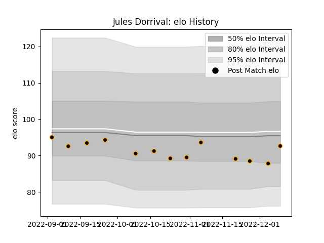

---  
layout: page  
title: Jules Dorrival  
date: 2023-01-17 11:46:40.062752  
categories: player  
---
# Jules Dorrival

## Positions: FB

## Current elo: 90.0

## Current Percentile: 21.0

# Elo History

# Match History

| Team     |   Appearances |   Win Rate |
|:---------|--------------:|-----------:|
| Chambery |            15 |   0.466667 |

| Opponent                   |   Matches |   Win Rate |
|:---------------------------|----------:|-----------:|
| Tarbes                     |         2 |        0.5 |
| US Bressane                |         2 |        0.5 |
| Albi                       |         1 |        0   |
| Blagnac                    |         1 |        0   |
| Bourgoin-Jallieu           |         1 |        0   |
| Carqueiranne-Hyères        |         1 |        0   |
| Cognac Saint Jean d'Angély |         1 |        1   |
| Dax                        |         1 |        0   |
| Narbonne                   |         1 |        1   |
| Nice                       |         1 |        1   |
| Rennes                     |         1 |        1   |
| Suresnes                   |         1 |        0   |
| Valence Romans Drome Rugby |         1 |        1   |