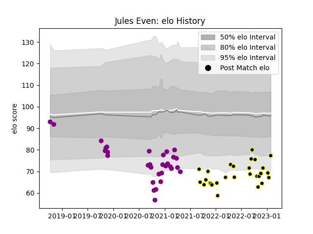

---  
layout: page  
title: Jules Even  
date: 2022-12-09 13:11:22.053167  
categories: player  
---
# Jules Even

## Positions: C, FB

## Current elo: 102.0

## Current Percentile: 59.0

# Elo History

# Match History

| Team             |   Appearances |   Win Rate |
|:-----------------|--------------:|-----------:|
| Soyaux-Angouleme |            20 |   0.3      |
| Mont-de-Marsan   |            19 |   0.631579 |

| Opponent           |   Matches |   Win Rate |
|:-------------------|----------:|-----------:|
| Beziers            |         4 |   0.75     |
| Provence Rugby     |         4 |   0.25     |
| Aurillac           |         3 |   1        |
| Colomiers          |         3 |   0.666667 |
| Nevers             |         3 |   0.333333 |
| Montauban          |         2 |   0        |
| Rouen              |         2 |   0        |
| Perpignan          |         2 |   0        |
| Oyonnax            |         2 |   0.5      |
| Vannes             |         2 |   0.5      |
| Carcassonne        |         2 |   0.5      |
| Biarritz Olympique |         2 |   0.5      |
| Mont-de-Marsan     |         1 |   1        |
| Massy              |         1 |   0        |
| Grenoble           |         1 |   0        |
| Bayonne            |         1 |   1        |
| Roval Drome XV     |         1 |   0        |
| Soyaux-Angouleme   |         1 |   1        |
| US Bressane        |         1 |   1        |
| Agen               |         1 |   0        |