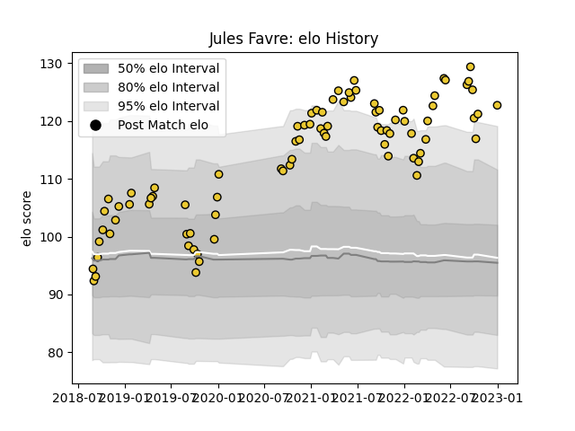

---  
layout: page  
title: Jules Favre  
date: 2023-01-06 00:10:07.496650  
categories: player  
---
# Jules Favre

## Positions: W, C

## Current elo: 124.0

## Current Percentile: 91.0

# Elo History

# Match History

| Team        |   Appearances |   Win Rate |
|:------------|--------------:|-----------:|
| La Rochelle |            83 |   0.650602 |

| Opponent             |   Matches |   Win Rate |
|:---------------------|----------:|-----------:|
| Stade Toulousain     |         8 |   0.125    |
| Montpellier Herault  |         8 |   0.375    |
| Clermont Auvergne    |         7 |   0.428571 |
| Lyon                 |         6 |   0.833333 |
| Pau                  |         6 |   1        |
| Toulon               |         6 |   0.833333 |
| Racing 92            |         6 |   0.666667 |
| Perpignan            |         6 |   0.833333 |
| Bordeaux Begles      |         4 |   0.75     |
| Stade Francais Paris |         4 |   0.75     |
| Castres Olympique    |         4 |   0.25     |
| Bayonne              |         4 |   0.5      |
| Agen                 |         3 |   1        |
| Brive                |         3 |   1        |
| Biarritz Olympique   |         2 |   0.5      |
| Grenoble             |         1 |   1        |
| RC Enisei            |         1 |   1        |
| Glasgow Warriors     |         1 |   1        |
| Sale Sharks          |         1 |   1        |
| Bristol Rugby        |         1 |   1        |
| Zebre                |         1 |   1        |