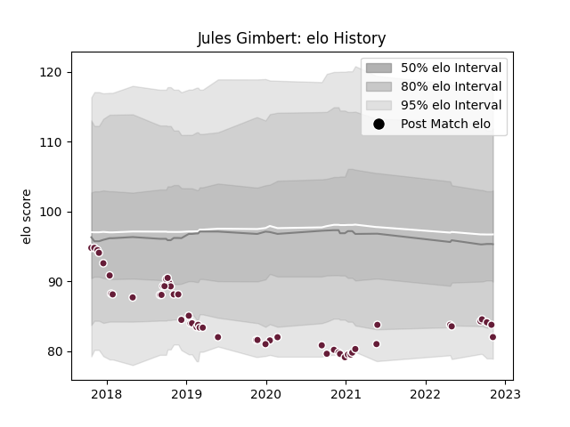

---  
layout: page  
title: Jules Gimbert  
date: 2022-11-16 11:37:55.794046  
categories: player  
---
# Jules Gimbert

## Positions: SH

## Current elo: 82.0

## Current Percentile: None

# Elo History

# Match History

| Team            |   Appearances |   Win Rate |
|:----------------|--------------:|-----------:|
| Bordeaux Begles |            52 |   0.538462 |

| Opponent             |   Matches |   Win Rate |
|:---------------------|----------:|-----------:|
| Montpellier Herault  |         6 |   0.583333 |
| Clermont Auvergne    |         4 |   0.75     |
| Toulon               |         4 |   0.5      |
| Agen                 |         4 |   0.75     |
| Stade Toulousain     |         3 |   0        |
| Stade Francais Paris |         3 |   0.666667 |
| Racing 92            |         3 |   0.333333 |
| Lyon                 |         3 |   0.333333 |
| Pau                  |         2 |   0.5      |
| Connacht             |         2 |   0        |
| Brive                |         2 |   0.75     |
| Perpignan            |         2 |   0.75     |
| Wasps                |         2 |   1        |
| La Rochelle          |         2 |   0.5      |
| Grenoble             |         2 |   0.5      |
| Dragons              |         2 |   0.5      |
| Newcastle Falcons    |         1 |   0        |
| Bayonne              |         1 |   1        |
| RC Enisei            |         1 |   1        |
| Sale Sharks          |         1 |   0        |
| Edinburgh            |         1 |   0.5      |
| Castres Olympique    |         1 |   1        |