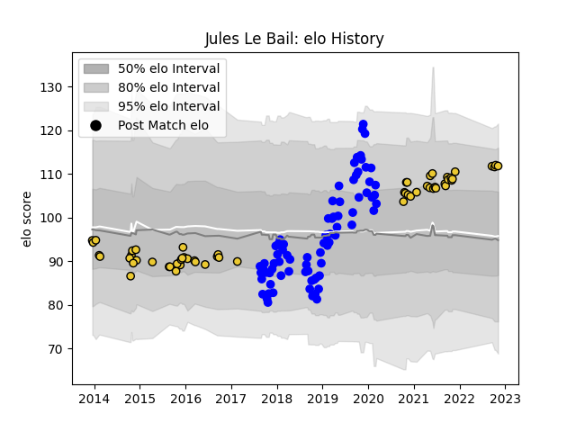

---  
layout: page  
title: Jules Le Bail  
date: 2023-02-28 11:09:04.904305  
categories: player  
---
# Jules Le Bail

## Positions: SH

## Current elo: 112.0

## Current Percentile: 85.0

# Elo History

# Match History

| Team        |   Appearances |   Win Rate |
|:------------|--------------:|-----------:|
| Vannes      |            77 |   0.487013 |
| La Rochelle |            58 |   0.517241 |

| Opponent             |   Matches |   Win Rate |
|:---------------------|----------:|-----------:|
| Bayonne              |        10 |   0.65     |
| Mont-de-Marsan       |         7 |   0.714286 |
| Aurillac             |         6 |   0.666667 |
| Biarritz Olympique   |         6 |   0.666667 |
| Soyaux-Angouleme     |         6 |   0.5      |
| Brive                |         6 |   0.166667 |
| Clermont Auvergne    |         5 |   0.2      |
| Nevers               |         5 |   0.4      |
| Perpignan            |         5 |   0.2      |
| Colomiers            |         5 |   0.4      |
| Pau                  |         5 |   1        |
| Beziers              |         5 |   0.6      |
| Carcassonne          |         4 |   0.5      |
| Grenoble             |         4 |   0.5      |
| Lyon                 |         4 |   0.5      |
| Montpellier Herault  |         4 |   0.25     |
| Provence Rugby       |         4 |   0.5      |
| Oyonnax              |         4 |   0.5      |
| Stade Francais Paris |         4 |   0.375    |
| Stade Toulousain     |         3 |   0        |
| Massy                |         3 |   0.666667 |
| Racing 92            |         3 |   0.333333 |
| Montauban            |         3 |   0        |
| Toulon               |         2 |   1        |
| US Bressane          |         2 |   0.75     |
| Roval Drome XV       |         2 |   1        |
| Zebre                |         2 |   0.5      |
| Narbonne             |         2 |   0.5      |
| Gloucester Rugby     |         2 |   0        |
| Dax                  |         2 |   0.5      |
| Bordeaux Begles      |         2 |   1        |
| Auch                 |         1 |   1        |
| Rouen                |         1 |   0        |
| Exeter Chiefs        |         1 |   0        |
| Connacht             |         1 |   0        |
| Tarbes               |         1 |   1        |
| Castres Olympique    |         1 |   1        |
| Worcester Warriors   |         1 |   0        |
| Agen                 |         1 |   1        |