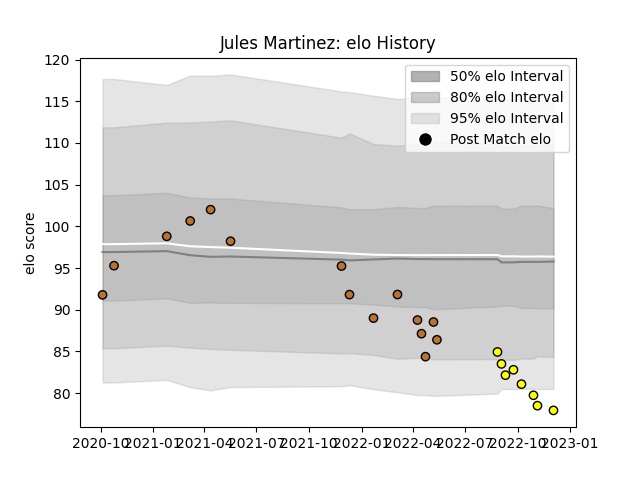

---  
layout: page  
title: Jules Martinez  
date: 2022-12-09 13:12:22.814640  
categories: player  
---
# Jules Martinez

## Positions: P

## Current elo: 78.0

## Current Percentile: 5.0

# Elo History

# Match History

| Team        |   Appearances |   Win Rate |
|:------------|--------------:|-----------:|
| Narbonne    |            15 |   0.366667 |
| Carcassonne |             8 |   0.25     |

| Opponent                   |   Matches |   Win Rate |
|:---------------------------|----------:|-----------:|
| Grenoble                   |         3 |   0.166667 |
| Colomiers                  |         2 |   0        |
| Dijon                      |         2 |   0.5      |
| Massy                      |         2 |   0.5      |
| Montauban                  |         2 |   0.5      |
| Oyonnax                    |         2 |   0        |
| Aubenas                    |         1 |   0        |
| Beziers                    |         1 |   1        |
| Biarritz Olympique         |         1 |   0        |
| Carcassonne                |         1 |   0        |
| Cognac Saint Jean d'Angély |         1 |   1        |
| Mont-de-Marsan             |         1 |   0        |
| Provence Rugby             |         1 |   0        |
| Tarbes                     |         1 |   1        |
| US Bressane                |         1 |   1        |
| Vannes                     |         1 |   0        |