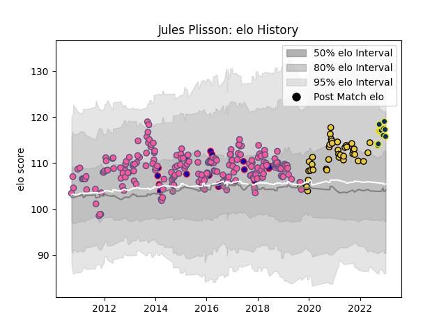

---  
layout: page  
title: Jules Plisson  
date: 2023-02-02 18:55:09.871061  
categories: player  
---
# Jules Plisson

## Positions: FH

## Country: France

## Current elo: 98.0

## Current Percentile: 53.0

# Elo History

# Match History

| Team                 |   Appearances |   Win Rate |
|:---------------------|--------------:|-----------:|
| Stade Francais Paris |           206 |   0.509709 |
| La Rochelle          |            39 |   0.641026 |
| France               |            19 |   0.368421 |
| Clermont Auvergne    |            15 |   0.433333 |

| Opponent             |   Matches |   Win Rate |
|:---------------------|----------:|-----------:|
| Toulon               |        21 |   0.404762 |
| Bordeaux Begles      |        18 |   0.583333 |
| Stade Toulousain     |        18 |   0.138889 |
| Castres Olympique    |        16 |   0.6875   |
| Clermont Auvergne    |        16 |   0.40625  |
| Racing 92            |        16 |   0.375    |
| Montpellier Herault  |        15 |   0.466667 |
| Pau                  |        13 |   0.692308 |
| Brive                |        13 |   0.538462 |
| Lyon                 |        10 |   0.3      |
| Bayonne              |        10 |   0.5      |
| La Rochelle          |        10 |   0.45     |
| Perpignan            |        10 |   0.7      |
| Grenoble             |         8 |   0.75     |
| Agen                 |         7 |   0.571429 |
| Stade Francais Paris |         7 |   0.428571 |
| Biarritz Olympique   |         6 |   0.833333 |
| Oyonnax              |         6 |   0.5      |
| London Irish         |         4 |   0.5      |
| Worcester Warriors   |         4 |   0.5      |
| New Zealand          |         4 |   0        |
| England              |         3 |   0.333333 |
| Edinburgh            |         3 |   0.333333 |
| Italy                |         3 |   1        |
| Munster              |         2 |   0.5      |
| South Africa         |         2 |   0        |
| Scotland             |         2 |   0.5      |
| Timisoara Saracens   |         2 |   1        |
| Wales                |         2 |   0        |
| Ospreys              |         2 |   1        |
| Leicester Tigers     |         2 |   0.5      |
| Mont-de-Marsan       |         2 |   1        |
| Argentina            |         2 |   0.5      |
| Harlequins           |         2 |   0.5      |
| Crociati Rugby       |         2 |   1        |
| Cavalieri Prato      |         2 |   1        |
| Bucuresti            |         2 |   1        |
| Bath Rugby           |         2 |   1        |
| Yorkshire Carnegie   |         2 |   1        |
| London Welsh         |         1 |   1        |
| Leinster             |         1 |   0        |
| Krasny Yar           |         1 |   0        |
| Ireland              |         1 |   1        |
| Gloucester Rugby     |         1 |   1        |
| Glasgow Warriors     |         1 |   0        |
| Stormers             |         1 |   1        |
| Benetton Treviso     |         1 |   1        |