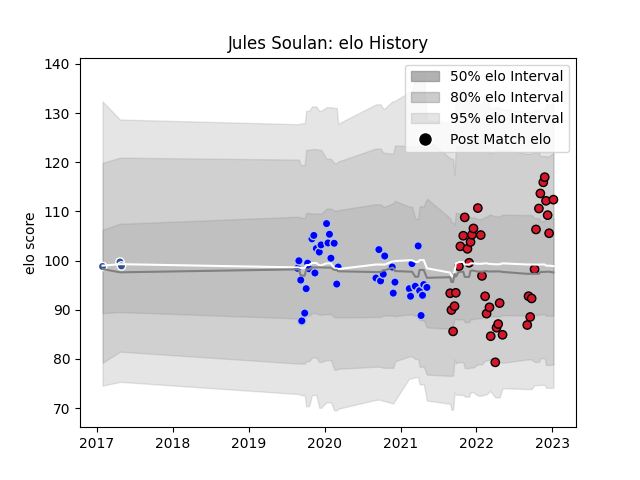

---  
layout: page  
title: Jules Soulan  
date: 2022-12-18 16:25:28.102808  
categories: player  
---
# Jules Soulan

## Positions: FH

## Current elo: 112.0

## Current Percentile: 88.0

# Elo History

# Match History

| Team      |   Appearances |   Win Rate |
|:----------|--------------:|-----------:|
| Oyonnax   |            33 |   0.787879 |
| Colomiers |            26 |   0.730769 |

| Opponent                   |   Matches |   Win Rate |
|:---------------------------|----------:|-----------:|
| Nevers                     |         6 |   0.833333 |
| Vannes                     |         5 |   0.6      |
| Beziers                    |         5 |   0.7      |
| Provence Rugby             |         5 |   0.5      |
| Soyaux-Angouleme           |         4 |   0.5      |
| Mont-de-Marsan             |         4 |   0.5      |
| Montauban                  |         4 |   1        |
| Aurillac                   |         4 |   1        |
| Rouen                      |         3 |   1        |
| US Bressane                |         2 |   1        |
| Oyonnax                    |         2 |   1        |
| Agen                       |         2 |   1        |
| Grenoble                   |         2 |   1        |
| Colomiers                  |         2 |   0.5      |
| Carcassonne                |         2 |   1        |
| Bayonne                    |         2 |   0.5      |
| Massy                      |         1 |   1        |
| Perpignan                  |         1 |   0        |
| Roval Drome XV             |         1 |   1        |
| Valence Romans Drome Rugby |         1 |   1        |
| Narbonne                   |         1 |   1        |