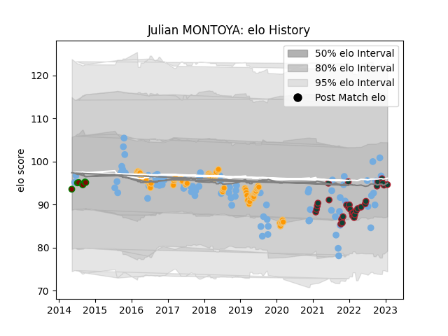

---  
layout: page  
title: Julian MONTOYA  
date: 2023-02-17 14:40:10.073433  
categories: player  
---
# Julian MONTOYA

## Positions: H

## Country: Argentina

## Current elo: 92.0

## Current Percentile: 44.0

# Elo History

# Match History

| Team             |   Appearances |   Win Rate |
|:-----------------|--------------:|-----------:|
| Argentina        |            84 |   0.285714 |
| Jaguares         |            63 |   0.52381  |
| Leicester Tigers |            34 |   0.720588 |
| Newman           |             7 |   0.428571 |

| Opponent                 |   Matches |   Win Rate |
|:-------------------------|----------:|-----------:|
| Australia                |        16 |   0.21875  |
| New Zealand              |        15 |   0.133333 |
| South Africa             |        14 |   0.142857 |
| Lions                    |         9 |   0.444444 |
| Sharks                   |         7 |   0.428571 |
| Scotland                 |         7 |   0.142857 |
| Stormers                 |         6 |   0.166667 |
| England                  |         6 |   0.166667 |
| Bulls                    |         6 |   0.833333 |
| France                   |         5 |   0.2      |
| Ireland                  |         5 |   0.2      |
| Wales                    |         5 |   0.3      |
| Hurricanes               |         4 |   0.25     |
| Brumbies                 |         4 |   0.75     |
| Bristol Rugby            |         4 |   0.625    |
| Northampton Saints       |         4 |   0.75     |
| Sale Sharks              |         4 |   0.25     |
| Southern Kings           |         4 |   0.5      |
| Chiefs                   |         4 |   0.5      |
| New South Wales Waratahs |         3 |   1        |
| London Irish             |         3 |   1        |
| Italy                    |         3 |   1        |
| Worcester Warriors       |         3 |   1        |
| Harlequins               |         3 |   0.666667 |
| Blues                    |         3 |   0.666667 |
| Wasps                    |         3 |   0.666667 |
| Queensland Reds          |         3 |   0.666667 |
| Highlanders              |         2 |   0        |
| Georgia                  |         2 |   1        |
| Crusaders                |         2 |   0        |
| Tonga                    |         2 |   1        |
| Melbourne Rebels         |         2 |   1        |
| Clermont Auvergne        |         2 |   1        |
| Cheetahs                 |         2 |   1        |
| Romania                  |         1 |   1        |
| Sunwolves                |         1 |   1        |
| United States of America |         1 |   1        |
| Saracens                 |         1 |   1        |
| Western Force            |         1 |   0        |
| Atlético del Rosario     |         1 |   0        |
| Regatas Bella Vista      |         1 |   1        |
| Pueyrredón               |         1 |   1        |
| Ospreys                  |         1 |   0        |
| Newcastle Falcons        |         1 |   1        |
| Namibia                  |         1 |   1        |
| La Plata                 |         1 |   0        |
| Japan                    |         1 |   1        |
| Gloucester Rugby         |         1 |   1        |
| Exeter Chiefs            |         1 |   1        |
| Connacht                 |         1 |   1        |
| CUBA                     |         1 |   0        |
| CASI                     |         1 |   0        |
| Belgrano                 |         1 |   1        |
| Bath Rugby               |         1 |   1        |
| Leinster                 |         1 |   0        |