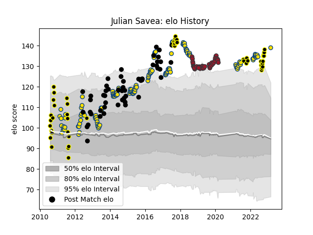

---  
layout: page  
title: Julian Savea  
date: 2023-03-17 17:38:37.476968  
categories: player  
---
# Julian Savea

## Positions: W

## Country: New Zealand

## Current elo: 136.0

## Current Percentile: 98.0

# Elo History

# Match History

| Team        |   Appearances |   Win Rate |
|:------------|--------------:|-----------:|
| Hurricanes  |           146 |   0.60274  |
| New Zealand |            55 |   0.909091 |
| Wellington  |            50 |   0.7      |
| Toulon      |            41 |   0.560976 |

| Opponent                 |   Matches |   Win Rate |
|:-------------------------|----------:|-----------:|
| Highlanders              |        19 |   0.526316 |
| Blues                    |        19 |   0.578947 |
| Crusaders                |        18 |   0.444444 |
| Chiefs                   |        18 |   0.416667 |
| Australia                |        13 |   0.884615 |
| Brumbies                 |        11 |   0.272727 |
| Melbourne Rebels         |         9 |   0.888889 |
| Argentina                |         9 |   1        |
| Queensland Reds          |         9 |   0.888889 |
| New South Wales Waratahs |         8 |   0.75     |
| Canterbury               |         7 |   0.571429 |
| South Africa             |         7 |   0.857143 |
| Bulls                    |         6 |   0.5      |
| Lions                    |         6 |   0.833333 |
| England                  |         5 |   0.8      |
| Waikato                  |         5 |   0.6      |
| Ireland                  |         5 |   0.8      |
| Hawke's Bay              |         5 |   0.8      |
| Northland                |         5 |   0.8      |
| Western Force            |         5 |   1        |
| Sharks                   |         5 |   0.6      |
| Taranaki                 |         4 |   1        |
| France                   |         4 |   1        |
| Tasman                   |         4 |   0.5      |
| Manawatu                 |         4 |   0.5      |
| Stade Francais Paris     |         4 |   0.5      |
| La Rochelle              |         4 |   0.25     |
| Cheetahs                 |         4 |   0.75     |
| Wales                    |         4 |   1        |
| Southland                |         3 |   1        |
| Stormers                 |         3 |   0.666667 |
| Montpellier Herault      |         3 |   0.5      |
| Otago                    |         3 |   1        |
| Agen                     |         3 |   0.666667 |
| Lyon                     |         3 |   0        |
| Auckland                 |         3 |   0.333333 |
| Bay of Plenty            |         3 |   0.666667 |
| Bayonne                  |         3 |   1        |
| Jaguares                 |         2 |   1        |
| Bordeaux Begles          |         2 |   0.5      |
| Sunwolves                |         2 |   1        |
| British and Irish Lions  |         2 |   0.5      |
| Stade Toulousain         |         2 |   0.75     |
| Castres Olympique        |         2 |   1        |
| Clermont Auvergne        |         2 |   0.5      |
| Counties Manukau         |         2 |   0.5      |
| Scotland                 |         2 |   1        |
| Edinburgh                |         2 |   0        |
| Pau                      |         2 |   0.5      |
| Grenoble                 |         2 |   0.5      |
| North Harbour            |         2 |   1        |
| Newcastle Falcons        |         2 |   0.5      |
| Scarlets                 |         1 |   1        |
| Samoa                    |         1 |   1        |
| Racing 92                |         1 |   1        |
| Southern Kings           |         1 |   1        |
| Perpignan                |         1 |   1        |
| Brive                    |         1 |   1        |
| Georgia                  |         1 |   1        |
| United States of America |         1 |   1        |
| Italy                    |         1 |   1        |
| Namibia                  |         1 |   1        |
| London Irish             |         1 |   1        |