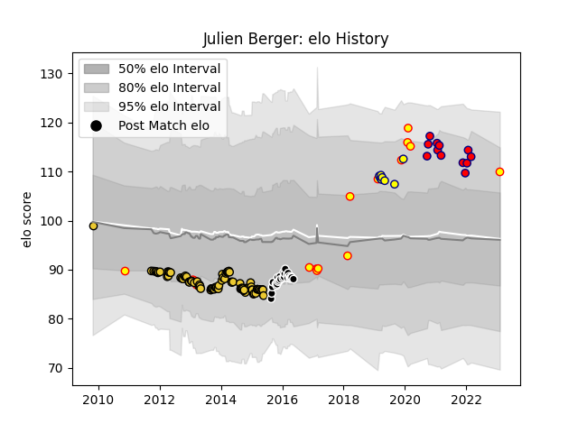

---  
layout: page  
title: Julien Berger  
date: 2023-02-05 15:08:57.777997  
categories: player  
---
# Julien Berger

## Positions: SH

## Country: Belgium

## Current elo: 110.0

## Current Percentile: 87.0

# Elo History

# Match History

| Team                       |   Appearances |   Win Rate |
|:---------------------------|--------------:|-----------:|
| La Rochelle                |            82 |   0.573171 |
| Provence Rugby             |            26 |   0.269231 |
| Belgium                    |            19 |   0.184211 |
| Cognac Saint Jean d'Angély |            12 |   0.375    |
| Nevers                     |             8 |   0.375    |

| Opponent             |   Matches |   Win Rate |
|:---------------------|----------:|-----------:|
| Colomiers            |         7 |   0.714286 |
| Narbonne             |         7 |   0.285714 |
| Lyon                 |         6 |   0.25     |
| Tarbes               |         6 |   0.416667 |
| Aurillac             |         6 |   0.666667 |
| Dax                  |         6 |   0.333333 |
| Mont-de-Marsan       |         6 |   0.333333 |
| Albi                 |         6 |   0.666667 |
| Pau                  |         5 |   0.6      |
| Beziers              |         5 |   0.6      |
| Provence Rugby       |         5 |   0.6      |
| Oyonnax              |         4 |   0.25     |
| Brive                |         4 |   0.25     |
| Carcassonne          |         4 |   0.75     |
| Portugal             |         4 |   0        |
| Bourgoin-Jallieu     |         4 |   0.5      |
| Russia               |         4 |   0.25     |
| Spain                |         4 |   0.375    |
| Bayonne              |         4 |   0.25     |
| Agen                 |         3 |   0.333333 |
| Grenoble             |         3 |   0.333333 |
| US Bressane          |         3 |   0.666667 |
| Auch                 |         3 |   1        |
| Castres Olympique    |         2 |   0.5      |
| Toulon               |         2 |   0.5      |
| Suresnes             |         2 |   0.5      |
| Stade Toulousain     |         2 |   0.5      |
| Stade Francais Paris |         2 |   0.25     |
| Biarritz Olympique   |         2 |   0.5      |
| Racing 92            |         2 |   0.25     |
| Bordeaux Begles      |         2 |   0.5      |
| Germany              |         2 |   0.5      |
| Georgia              |         2 |   0        |
| Montauban            |         2 |   0.5      |
| Connacht             |         2 |   0        |
| Dijon                |         2 |   1        |
| Perpignan            |         2 |   0.5      |
| Chambery             |         1 |   0        |
| Nice                 |         1 |   0        |
| Canada               |         1 |   0        |
| Clermont Auvergne    |         1 |   1        |
| Montpellier Herault  |         1 |   0.5      |
| Romania              |         1 |   0        |
| Blagnac              |         1 |   1        |
| Massy                |         1 |   1        |
| Hong Kong            |         1 |   0        |
| Exeter Chiefs        |         1 |   0        |