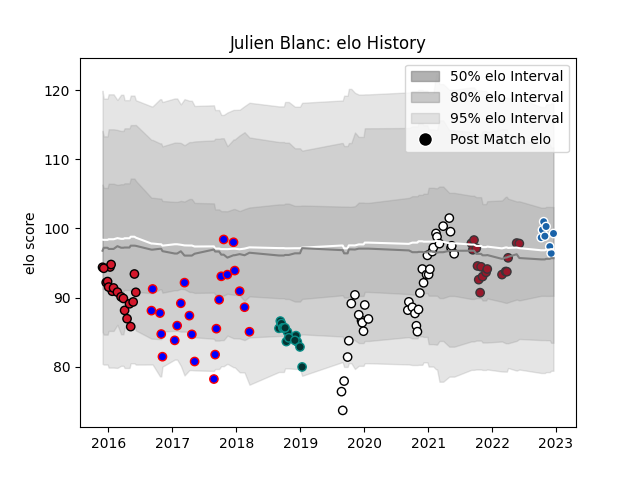

---  
layout: page  
title: Julien Blanc  
date: 2022-12-18 16:23:55.909124  
categories: player  
---
# Julien Blanc

## Positions: SH

## Current elo: 99.0

## Current Percentile: 56.0

# Elo History

# Match History

| Team              |   Appearances |   Win Rate |
|:------------------|--------------:|-----------:|
| Brive             |            38 |   0.486842 |
| Beziers           |            24 |   0.354167 |
| Oyonnax           |            19 |   0.157895 |
| Toulon            |            17 |   0.529412 |
| Pau               |            14 |   0.428571 |
| Castres Olympique |             8 |   0.5      |

| Opponent             |   Matches |   Win Rate |
|:---------------------|----------:|-----------:|
| Stade Francais Paris |         9 |   0.444444 |
| Pau                  |         8 |   0.6875   |
| Stade Toulousain     |         7 |   0.285714 |
| Clermont Auvergne    |         7 |   0.428571 |
| Montpellier Herault  |         7 |   0.357143 |
| La Rochelle          |         6 |   0.5      |
| Toulon               |         6 |   0.5      |
| Racing 92            |         6 |   0        |
| Lyon                 |         6 |   0.5      |
| Agen                 |         5 |   0.6      |
| Bayonne              |         5 |   0.5      |
| Castres Olympique    |         5 |   0.2      |
| Montauban            |         4 |   0.125    |
| Grenoble             |         4 |   0.5      |
| Brive                |         4 |   0.25     |
| Bordeaux Begles      |         3 |   0.666667 |
| Perpignan            |         3 |   0.666667 |
| Aurillac             |         3 |   0.666667 |
| Mont-de-Marsan       |         2 |   0        |
| Worcester Warriors   |         2 |   0.5      |
| Ulster               |         2 |   0        |
| Oyonnax              |         2 |   0.5      |
| Carcassonne          |         2 |   0.5      |
| Biarritz Olympique   |         2 |   0.5      |
| Soyaux-Angouleme     |         2 |   0        |
| Vannes               |         1 |   0        |
| Saracens             |         1 |   0        |
| Albi                 |         1 |   0        |
| Massy                |         1 |   1        |
| Ospreys              |         1 |   0        |
| Nevers               |         1 |   1        |
| Edinburgh            |         1 |   0        |
| Zebre                |         1 |   1        |