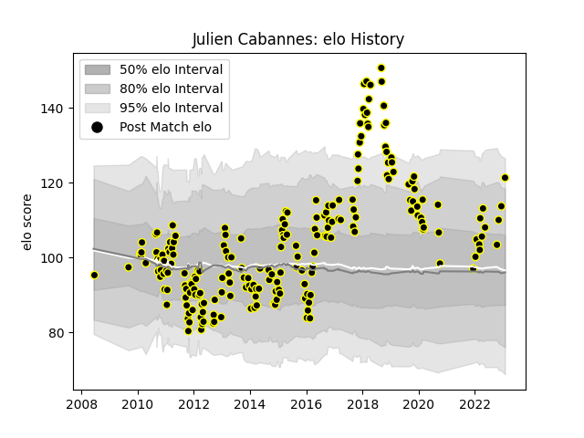

---  
layout: page  
title: Julien Cabannes  
date: 2023-03-21 17:59:19.185779  
categories: player  
---
# Julien Cabannes

Last updated: 2023-03-21
## Positions: W

## Current elo: 113.0

## Current Percentile: 91.0

# Elo History

# Match History

| Team           |   Appearances |   Win Rate |
|:---------------|--------------:|-----------:|
| Mont-de-Marsan |           220 |   0.522727 |

| Opponent            |   Matches |   Win Rate |
|:--------------------|----------:|-----------:|
| Colomiers           |        14 |   0.535714 |
| Beziers             |        14 |   0.678571 |
| Aurillac            |        13 |   0.384615 |
| Dax                 |        13 |   0.769231 |
| Carcassonne         |        12 |   0.666667 |
| Grenoble            |        12 |   0.416667 |
| Albi                |        11 |   0.909091 |
| Narbonne            |        10 |   0.7      |
| Montauban           |         9 |   0.666667 |
| Perpignan           |         8 |   0.375    |
| Tarbes              |         7 |   0.571429 |
| Provence Rugby      |         7 |   0.285714 |
| Oyonnax             |         7 |   0.428571 |
| Agen                |         7 |   0.142857 |
| Bayonne             |         7 |   0.285714 |
| Bourgoin-Jallieu    |         6 |   0.5      |
| Auch                |         6 |   0.666667 |
| Biarritz Olympique  |         6 |   0.666667 |
| Vannes              |         6 |   0.5      |
| Pau                 |         5 |   0.8      |
| Soyaux-Angouleme    |         5 |   0.4      |
| Nevers              |         4 |   0.5      |
| Bordeaux Begles     |         4 |   0.25     |
| Lyon                |         4 |   0        |
| US Bressane         |         3 |   0.666667 |
| La Rochelle         |         3 |   0.333333 |
| Rouen               |         3 |   0.666667 |
| Clermont Auvergne   |         2 |   0        |
| Saint-Etienne       |         2 |   1        |
| Toulon              |         2 |   0        |
| Stade Toulousain    |         1 |   0        |
| Brive               |         1 |   1        |
| Roval Drome XV      |         1 |   0        |
| Montpellier Herault |         1 |   0        |
| Périgueux           |         1 |   1        |
| Castres Olympique   |         1 |   0        |
| Massy               |         1 |   0        |
| Racing 92           |         1 |   0        |