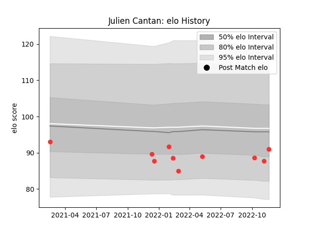

---  
layout: page  
title: Julien Cantan  
date: 2022-11-22 11:39:51.483141  
categories: player  
---
# Julien Cantan

## Positions: C

## Current elo: 91.0

## Current Percentile: 24.0

# Elo History

# Match History

| Team   |   Appearances |   Win Rate |
|:-------|--------------:|-----------:|
| Tarbes |            10 |       0.25 |

| Opponent                   |   Matches |   Win Rate |
|:---------------------------|----------:|-----------:|
| Albi                       |         3 |   0.666667 |
| Blagnac                    |         1 |   0        |
| Carqueiranne-Hyères        |         1 |   0        |
| Dijon                      |         1 |   0.5      |
| Nice                       |         1 |   0        |
| Suresnes                   |         1 |   0        |
| US Bressane                |         1 |   0        |
| Valence Romans Drome Rugby |         1 |   0        |