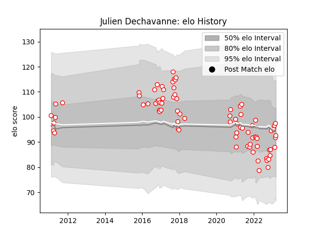

---  
layout: page  
title: Julien Dechavanne  
date: 2023-01-23 15:35:02.198512  
categories: player  
---
# Julien Dechavanne

## Positions: W

## Current elo: 92.0

## Current Percentile: 41.0

# Elo History

# Match History

| Team   |   Appearances |   Win Rate |
|:-------|--------------:|-----------:|
| Dax    |            75 |       0.48 |

| Opponent                   |   Matches |   Win Rate |
|:---------------------------|----------:|-----------:|
| Narbonne                   |         7 |   0.571429 |
| Chambery                   |         5 |   0.8      |
| Bourgoin-Jallieu           |         5 |   0.6      |
| Blagnac                    |         4 |   0.75     |
| Albi                       |         4 |   0        |
| Nice                       |         3 |   0.666667 |
| Soyaux-Angouleme           |         3 |   0.666667 |
| Beziers                    |         3 |   0.666667 |
| Mont-de-Marsan             |         3 |   0        |
| Dijon                      |         3 |   0.666667 |
| Cognac Saint Jean d'Angély |         3 |   0.333333 |
| Colomiers                  |         2 |   0.5      |
| Montauban                  |         2 |   0        |
| Suresnes                   |         2 |   0        |
| Vannes                     |         2 |   1        |
| Tarbes                     |         2 |   1        |
| Carcassonne                |         2 |   0        |
| Biarritz Olympique         |         2 |   0.5      |
| Aurillac                   |         2 |   0.5      |
| Aubenas                    |         2 |   0.5      |
| Perpignan                  |         2 |   0        |
| Provence Rugby             |         1 |   1        |
| US Bressane                |         1 |   0        |
| Valence Romans Drome Rugby |         1 |   1        |
| Rennes                     |         1 |   1        |
| Agen                       |         1 |   0        |
| Oyonnax                    |         1 |   0        |
| Nevers                     |         1 |   1        |
| Massy                      |         1 |   0        |
| Carqueiranne-Hyères        |         1 |   1        |
| Bordeaux Begles            |         1 |   0        |
| Bayonne                    |         1 |   0        |
| Grenoble                   |         1 |   0        |