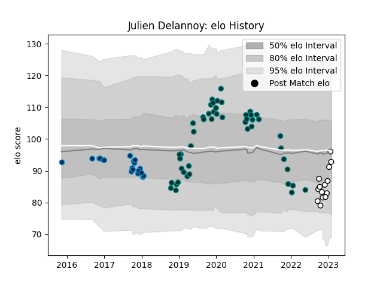

---  
layout: page  
title: Julien Delannoy  
date: 2023-02-02 19:02:08.437686  
categories: player  
---
# Julien Delannoy

## Positions: L

## Current elo: 93.0

## Current Percentile: 51.0

# Elo History

# Match History

| Team                |   Appearances |   Win Rate |
|:--------------------|--------------:|-----------:|
| Pau                 |            48 |   0.375    |
| Montpellier Herault |            19 |   0.368421 |
| Brive               |            14 |   0.285714 |

| Opponent             |   Matches |   Win Rate |
|:---------------------|----------:|-----------:|
| Toulon               |         9 |   0.277778 |
| La Rochelle          |         7 |   0        |
| Lyon                 |         6 |   0.416667 |
| Castres Olympique    |         6 |   0.333333 |
| Bordeaux Begles      |         6 |   0.5      |
| Brive                |         5 |   0.4      |
| Stade Francais Paris |         5 |   0.2      |
| Montpellier Herault  |         5 |   0.4      |
| Clermont Auvergne    |         4 |   0.25     |
| Bayonne              |         3 |   0.666667 |
| Racing 92            |         3 |   0.333333 |
| Pau                  |         3 |   0.333333 |
| Ospreys              |         2 |   0.5      |
| Worcester Warriors   |         2 |   1        |
| Leinster             |         2 |   0        |
| Exeter Chiefs        |         2 |   0        |
| Cardiff Blues        |         2 |   0.5      |
| Calvisano            |         2 |   1        |
| London Irish         |         1 |   0        |
| Grenoble             |         1 |   1        |
| Glasgow Warriors     |         1 |   1        |
| Perpignan            |         1 |   1        |
| Connacht             |         1 |   0        |
| Stade Toulousain     |         1 |   0        |
| Leicester Tigers     |         1 |   0        |