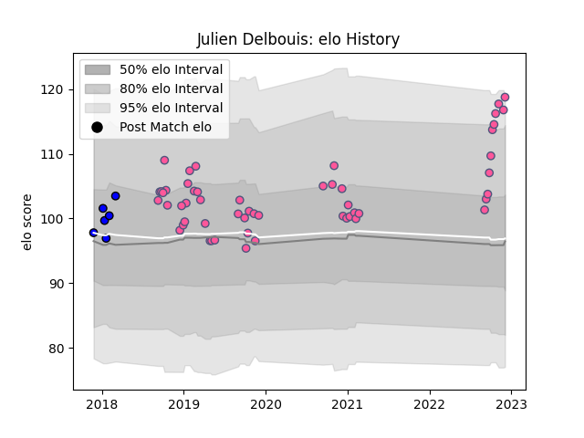

---  
layout: page  
title: Julien Delbouis  
date: 2022-12-09 13:22:00.707615  
categories: player  
---
# Julien Delbouis

## Positions: C

## Current elo: 119.0

## Current Percentile: 92.0

# Elo History

# Match History

| Team                 |   Appearances |   Win Rate |
|:---------------------|--------------:|-----------:|
| Stade Francais Paris |            53 |   0.443396 |
| Massy                |             6 |   0.666667 |

| Opponent            |   Matches |   Win Rate |
|:--------------------|----------:|-----------:|
| Pau                 |         5 |   0.6      |
| Toulon              |         5 |   0.6      |
| Castres Olympique   |         5 |   0.6      |
| Stade Toulousain    |         4 |   0.375    |
| Brive               |         4 |   0.5      |
| Clermont Auvergne   |         4 |   0.25     |
| La Rochelle         |         4 |   0.5      |
| Racing 92           |         4 |   0.25     |
| Bayonne             |         3 |   0.666667 |
| Grenoble            |         3 |   0.666667 |
| Agen                |         2 |   0.5      |
| Perpignan           |         2 |   1        |
| Montpellier Herault |         2 |   0        |
| Lyon                |         2 |   0        |
| Bordeaux Begles     |         2 |   0        |
| Worcester Warriors  |         2 |   0        |
| Nevers              |         1 |   1        |
| Ospreys             |         1 |   1        |
| Narbonne            |         1 |   1        |
| Aurillac            |         1 |   1        |
| Benetton Treviso    |         1 |   0        |
| Vannes              |         1 |   0        |