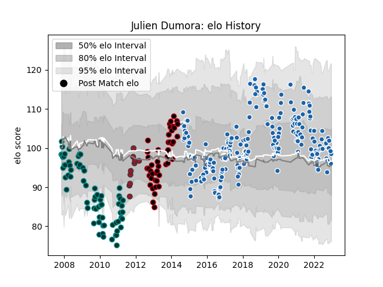

---  
layout: page  
title: Julien Dumora  
date: 2022-12-14 11:22:48.501782  
categories: player  
---
# Julien Dumora

## Positions: FB, FH

## Current elo: 96.0

## Current Percentile: 64.0

# Elo History

# Match History

| Team              |   Appearances |   Win Rate |
|:------------------|--------------:|-----------:|
| Castres Olympique |           216 |   0.534722 |
| Pau               |            69 |   0.507246 |
| Lyon              |            45 |   0.655556 |
| Toulon            |            10 |   0.7      |

| Opponent             |   Matches |   Win Rate |
|:---------------------|----------:|-----------:|
| La Rochelle          |        21 |   0.547619 |
| Lyon                 |        19 |   0.631579 |
| Racing 92            |        19 |   0.368421 |
| Montpellier Herault  |        19 |   0.473684 |
| Bordeaux Begles      |        18 |   0.416667 |
| Pau                  |        17 |   0.588235 |
| Toulon               |        16 |   0.375    |
| Stade Francais Paris |        16 |   0.375    |
| Brive                |        16 |   0.5625   |
| Stade Toulousain     |        15 |   0.566667 |
| Clermont Auvergne    |        14 |   0.5      |
| Grenoble             |        13 |   0.538462 |
| Oyonnax              |        12 |   0.416667 |
| Agen                 |        12 |   0.708333 |
| Aurillac             |         9 |   0.777778 |
| Bayonne              |         9 |   0.666667 |
| Tarbes               |         8 |   0.625    |
| Narbonne             |         7 |   0.428571 |
| Dax                  |         6 |   0.75     |
| Colomiers            |         6 |   0.916667 |
| Auch                 |         5 |   0.7      |
| Albi                 |         5 |   0.8      |
| Mont-de-Marsan       |         5 |   0.4      |
| Beziers              |         4 |   0.75     |
| Provence Rugby       |         4 |   0.5      |
| Perpignan            |         4 |   0.625    |
| Carcassonne          |         3 |   0.666667 |
| Leinster             |         3 |   0.166667 |
| Biarritz Olympique   |         3 |   1        |
| US Bressane          |         2 |   0.5      |
| Sale Sharks          |         2 |   0        |
| Wasps                |         2 |   0        |
| Northampton Saints   |         2 |   0.5      |
| Blagnac              |         2 |   1        |
| Dragons              |         2 |   1        |
| Newcastle Falcons    |         2 |   0.5      |
| Munster              |         2 |   0.25     |
| Massy                |         2 |   1        |
| Limoges              |         2 |   1        |
| Harlequins           |         2 |   0        |
| Exeter Chiefs        |         2 |   0.5      |
| Worcester Warriors   |         2 |   1        |
| Petrarca Padova      |         1 |   1        |
| RC Enisei            |         1 |   1        |
| Saint-Etienne        |         1 |   1        |
| Bourgoin-Jallieu     |         1 |   1        |
| Leicester Tigers     |         1 |   1        |
| Gloucester Rugby     |         1 |   0        |