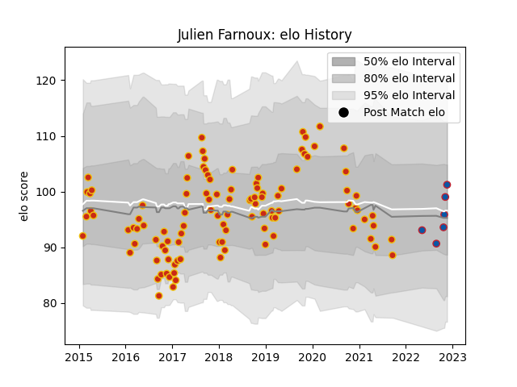

---  
layout: page  
title: Julien Farnoux  
date: 2023-02-04 18:28:24.730994  
categories: player  
---
# Julien Farnoux

## Positions: FB

## Current elo: 114.0

## Current Percentile: 78.0

# Elo History

# Match History

| Team      |   Appearances |   Win Rate |
|:----------|--------------:|-----------:|
| Perpignan |           124 |   0.552419 |
| Grenoble  |            14 |   0.75     |

| Opponent                   |   Matches |   Win Rate |
|:---------------------------|----------:|-----------:|
| Mont-de-Marsan             |        12 |   0.416667 |
| Aurillac                   |        11 |   0.590909 |
| Beziers                    |        10 |   0.6      |
| Carcassonne                |         9 |   0.888889 |
| Montauban                  |         9 |   0.666667 |
| Narbonne                   |         8 |   0.6875   |
| Colomiers                  |         6 |   0.333333 |
| Soyaux-Angouleme           |         5 |   0.9      |
| Biarritz Olympique         |         5 |   0.6      |
| Dax                        |         5 |   0.6      |
| Grenoble                   |         4 |   1        |
| Rouen                      |         4 |   0.5      |
| Nevers                     |         4 |   0.75     |
| Lyon                       |         4 |   0        |
| Agen                       |         4 |   0.5      |
| Bourgoin-Jallieu           |         3 |   1        |
| Oyonnax                    |         3 |   0.666667 |
| Provence Rugby             |         3 |   0.333333 |
| Bordeaux Begles            |         3 |   0.166667 |
| Bayonne                    |         3 |   1        |
| Vannes                     |         2 |   1        |
| Massy                      |         2 |   1        |
| Clermont Auvergne          |         2 |   0        |
| Toulon                     |         2 |   0        |
| Pau                        |         2 |   0.5      |
| Connacht                   |         2 |   0        |
| Stade Toulousain           |         1 |   0        |
| Valence Romans Drome Rugby |         1 |   1        |
| US Bressane                |         1 |   1        |
| Tarbes                     |         1 |   1        |
| La Rochelle                |         1 |   0        |
| Stade Francais Paris       |         1 |   0        |
| Sale Sharks                |         1 |   0        |
| Castres Olympique          |         1 |   0        |
| Montpellier Herault        |         1 |   1        |
| Albi                       |         1 |   0        |
| Racing 92                  |         1 |   0        |