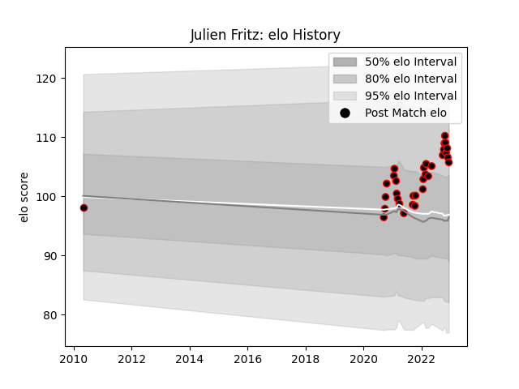

---  
layout: page  
title: Julien Fritz  
date: 2023-03-17 17:36:00.727057  
categories: player  
---
# Julien Fritz

## Positions: C

## Current elo: 101.0

## Current Percentile: 58.0

# Elo History

# Match History

| Team   |   Appearances |   Win Rate |
|:-------|--------------:|-----------:|
| Nice   |            44 |   0.693182 |
| Lyon   |             3 |   0.666667 |

| Opponent                   |   Matches |   Win Rate |
|:---------------------------|----------:|-----------:|
| Albi                       |         6 |   0.583333 |
| Tarbes                     |         5 |   0.8      |
| Valence Romans Drome Rugby |         4 |   0.25     |
| Bourgoin-Jallieu           |         4 |   0.75     |
| Suresnes                   |         4 |   0.75     |
| Aubenas                    |         3 |   1        |
| Blagnac                    |         3 |   0.666667 |
| US Bressane                |         3 |   0.666667 |
| Chambery                   |         3 |   0.666667 |
| Cognac Saint Jean d'Angély |         2 |   1        |
| Massy                      |         2 |   1        |
| Pau                        |         1 |   1        |
| Soyaux-Angouleme           |         1 |   1        |
| Agen                       |         1 |   0        |
| Narbonne                   |         1 |   0        |
| Dijon                      |         1 |   1        |
| Carqueiranne-Hyères        |         1 |   1        |
| Bordeaux Begles            |         1 |   1        |
| Dax                        |         1 |   0        |