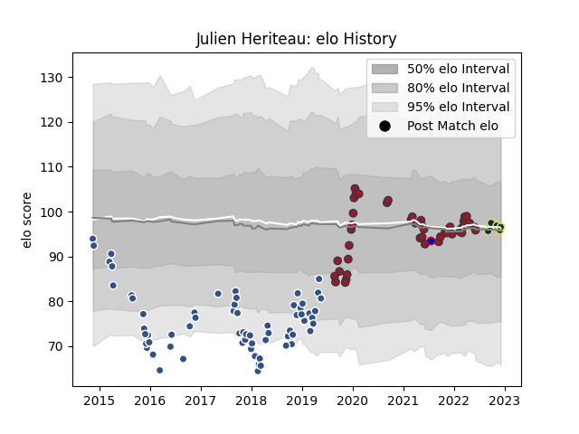

---  
layout: page  
title: Julien Heriteau  
date: 2022-12-09 13:05:20.945522  
categories: player  
---
# Julien Heriteau

## Positions: C

## Country: France

## Current elo: 94.0

## Current Percentile: 39.0

# Elo History

# Match History

| Team              |   Appearances |   Win Rate |
|:------------------|--------------:|-----------:|
| Agen              |            61 |   0.327869 |
| Toulon            |            43 |   0.616279 |
| Clermont Auvergne |             6 |   0.333333 |
| France            |             1 |   0        |

| Opponent             |   Matches |   Win Rate |
|:---------------------|----------:|-----------:|
| Lyon                 |         9 |   0.444444 |
| Montpellier Herault  |         9 |   0.277778 |
| Castres Olympique    |         8 |   0.375    |
| Stade Toulousain     |         8 |   0.3125   |
| La Rochelle          |         7 |   0.428571 |
| Racing 92            |         7 |   0.428571 |
| Clermont Auvergne    |         6 |   0.5      |
| Grenoble             |         5 |   0.3      |
| Pau                  |         5 |   0.5      |
| Toulon               |         5 |   0.2      |
| Stade Francais Paris |         5 |   0.4      |
| Brive                |         4 |   0.5      |
| Bordeaux Begles      |         4 |   0.5      |
| Bayonne              |         4 |   0.5      |
| Perpignan            |         3 |   0.666667 |
| London Irish         |         3 |   0.333333 |
| Oyonnax              |         2 |   0.5      |
| Scarlets             |         2 |   1        |
| Agen                 |         2 |   1        |
| Biarritz Olympique   |         2 |   1        |
| Harlequins           |         2 |   0        |
| Massy                |         1 |   1        |
| Australia            |         1 |   0        |
| Narbonne             |         1 |   0        |
| Edinburgh            |         1 |   0        |
| Dax                  |         1 |   1        |
| Colomiers            |         1 |   0.5      |
| Bourgoin-Jallieu     |         1 |   1        |
| Beziers              |         1 |   0        |
| Benetton Treviso     |         1 |   1        |